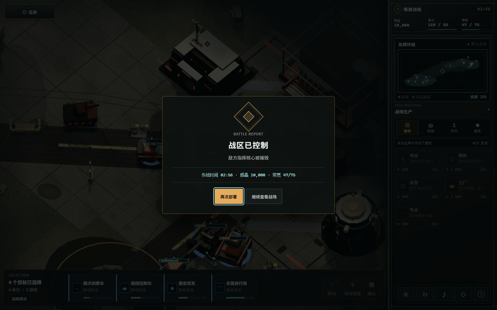

# Breakthrough formation-navigation closeout

## Outcome

The ordinary desktop breakthrough mission now reaches a natural victory through
normal simulation combat. A 10-unit formation can traverse the former command-
sector choke without sharing an intermediate waypoint indefinitely.

## Original soft lock

The mission could reach phase 5/5 while the enemy command core remained at its
authored starting health of 2600/5200. That displayed as 50%, even when the core
had not been damaged.

The decisive defect was in formation path following:

1. each unit received a distinct final formation slot;
2. A* routes converged on the same intermediate grid corner near the frontline
   defense;
3. every unit had to place its centre within 0.3 world units of that shared
   corner before advancing its waypoint index; and
4. tank and artillery collision separation prevented several large units from
   occupying that radius together.

As a result, surviving units could remain on the same intermediate
`waypointIndex` for hundreds of simulated seconds. If the observer was then
destroyed, the HQ also left current vision and an explicit attack could no
longer be issued. HQ targetability, damage calculation, and victory resolution
were otherwise valid.

## Minimal deterministic fix

Only non-final A* waypoint acceptance was widened. Its arrival radius is now:

`unit radius + 0.2 navigation padding + 0.75 half-grid allowance`

Intermediate waypoints are route hints, so a large unit no longer needs to
occupy the exact shared grid corner. The final waypoint and final formation
slot still use the original strict 0.3-unit arrival rule.

No stuck timer or hidden runtime map was added. Consequently the fix introduces:

- no wall-clock dependency;
- no new simulation state;
- no save or replay field;
- no state-hash input;
- no schema or migration change; and
- no change to the one-plane collision/navigation contract.

## Deterministic regression proof

The automated natural-assault regression uses the actual ordinary fixture and
the former soft-lock route:

- fixture: `breakthrough-demo`;
- seed: `1949`;
- opening force: all 10 `u-break-player-*` units;
- command: one `attackMove` to `{42, -39}`;
- at 120 simulated seconds: at least three routed heavy survivors must have
  advanced to `waypointIndex >= 2` rather than remaining at the shared corner;
- by the bounded terminal window: state must be `victory`, reason must be
  `敌方指挥核心被摧毁`, and mission phase must be `complete`;
- a mirrored simulation must have the same state hash at the route checkpoint
  and at the terminal state.

Separate movement regressions keep both single-unit and multi-unit final
destinations within the unchanged 0.3-unit tolerance.

## Real-browser proof

The final browser run used:

- URL: `http://127.0.0.1:4180/?fixture=breakthrough-demo&quality=high`;
- viewport: 1440 × 900;
- quality: `high`;
- camera navigation: minimap location approximately `{42, -39}`;
- player input: one attack-move for the opening 10-unit formation, with no
  follow-up command.

At `02:51`, the enemy core was at 17% and four surviving units were still
advancing. At `02:56`, normal combat produced:

- `战区已控制`;
- `敌方指挥核心被摧毁`;
- completed mission state;
- zero console warnings;
- zero console errors.

Selecting `再次部署` returned to the ordinary route at approximately `00:01`.

The camera-navigation contract used for this run is documented in
[minimap-camera-navigation.md](minimap-camera-navigation.md).

## Verification gate for this stage

This integration stage passed:

- TypeScript project build;
- 26 test files and 244 tests;
- replay and hash determinism checks; and
- the ordinary-route browser victory and retry path.

These are this-stage counts. Later asset or fixture work may change the final
repository totals.

## Boundary

This closeout proves natural victory, not natural defeat. Defeat remains covered
by `breakthrough-demo-defeat-review`. It does not certify mobile input, other
viewports, or other quality tiers.
