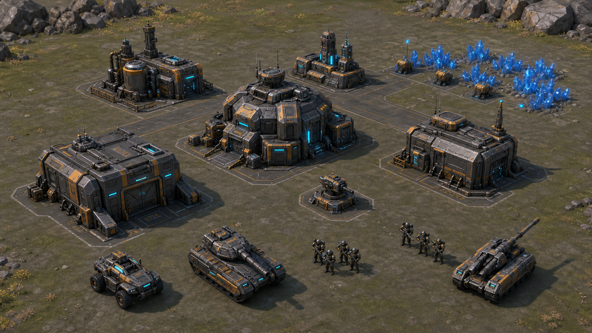

# 《断层战线》原创即时战略游戏设计方案

版本：0.1 立项基线  
目标平台：桌面浏览器 / Windows，键盘鼠标优先  
建议原型技术：TypeScript + Three.js + React HUD  
目标单局：15–25 分钟  

> 《断层战线》借鉴经典基地建造 RTS 的操作习惯和节奏，但世界观、阵营、单位、建筑、地图、音乐、声音与界面均保持原创，不复刻《命令与征服：红色警戒》的具体素材或标志性设计。

## 1. 一句话定位

一款“上手熟悉、战场清楚、调度有深度”的原创近未来 RTS：玩家在同一平面战场上采集辉晶、维持电力与指挥网络、扩建基地、组织多兵种编队，并通过摧毁敌方核心或持续控制中央信标赢得胜利。

## 2. 最重要的产品决定

先做一张地图、一个镜像阵营、七种单位的完整可玩闭环，再扩展到两套非对称阵营。不要在灰盒玩法和默认镜头尚未锁定前批量制作最终模型。

这个顺序能同时解决三个风险：

- 操作手感和寻路不成熟时，美术资产不会被反复返工。
- 所有模型都能在真实 RTS 镜头距离下校验比例、轮廓和阵营色。
- 先验证经济—生产—交战—胜负闭环，再承担非对称平衡成本。

## 3. 设计支柱

| 支柱 | 玩家感受 | 设计约束 |
| --- | --- | --- |
| 熟悉的指挥 | 不看教程也能移动、攻击、框选和编队 | 左键选择、右键情境命令、A 移动攻击、Ctrl 数字编队 |
| 清楚的战场 | 默认缩放下可快速分辨单位职责和危险 | 强轮廓、少材质、角色色、射程预告、同一玩法平面 |
| 简洁的宏观 | 资源管理重要，但不会淹没战术 | 一种可消耗资源 + 电力 + 指挥带宽 |
| 有代价的决策 | 扩张、科技、暴兵和防守不能同时最大化 | 主矿会衰减、科技建筑高耗电、单位存在硬软克制 |
| 可攻击的网络 | 不必只靠正面拆基地，也能切断敌方关键区 | 后勤节点、20 秒备用供能、清楚的断网预告 |
| 原创的阵营 | 保留类型乐趣，不复制既有 IP | 原创命名、原创造型语法、不同机制而非换皮数值 |

## 4. 目标玩家与体验边界

- 核心玩家：喜欢经典基地建造 RTS，但希望操作更现代、信息更清楚的玩家。
- 首版模式：1v1 玩家对 AI；之后增加玩家对玩家和 2v2。
- 默认输入：键盘鼠标；手柄和移动端不进入首版范围。
- 默认镜头：固定方位的三分之四俯视镜头，可缩放、不可自由旋转；降低迷路和遮挡。
- 战场上限：首版双方合计约 120–160 个可战斗实体。
- 首版不做：海军、可行走高地、英雄养成、全球大战略、完整联机、剧情战役编辑器。

默认验收镜头冻结为：正交投影、方位角 45°、相对水平面俯角 55°、参考视口 1920×1080、默认纵向世界跨度 48 米、缩放范围 32–80 米。轮廓与 LOD 均按 CSS 像素中的投影包围盒最长边判定。

### 4.1 版本范围定义

| 阶段 | 精确范围 | 不包含 |
| --- | --- | --- |
| 10 周垂直切片 | 赫利俄斯镜像对战、1 张 1v1 地图、T0–T2、7 个单位、6 类建筑、1 套正常 AI、完整经济/电力/网络/战斗/信标/回放 | 第二阵营、T3、航空、高阶单位、正式联机 |
| Alpha | 两个阵营各自基础阵容、9 类建筑、T3、第二张地图、三档 AI | 排位、战役、海军 |
| Beta | 航空、高阶单位、阵营升级、教程与联机技术验证 | 英雄、超级武器、可行走高地 |

除非特别标注，本方案中的“10 周计划”和“首个可玩版”均指垂直切片；双阵营、航空和 T3 表格描述的是完整产品目标。垂直切片的 6 类建筑为：指挥核心、反应堆、精炼站、兵营、载具工厂、可安装防御模块的后勤节点。

## 5. 核心循环

1. 侦察：发现资源、敌方开局和中立目标。
2. 发展：部署反应堆、精炼站和生产建筑。
3. 决策：在扩张、科技、单位数量和防御之间分配辉晶与电力。
4. 编队：垂直切片以侦察、前排、反甲、压制、炮兵和支援组成联合兵种；完整产品再加入防空与航空。
5. 争夺：攻击矿线、切断电力或指挥中继、抢占中央信标或侧翼资源区。
6. 终局：摧毁敌方指挥核心，或在计时结束前完成信标控制。

### 单局节奏

| 时间 | 阶段 | 预期事件 |
| --- | --- | --- |
| 0–3 分钟 | 展开 | 首个电站、精炼站、兵营；侦察车寻找路线 |
| 3–8 分钟 | 接触 | 小队交战、第一次骚扰、选择工厂或经济扩张 |
| 8–15 分钟 | 成形 | 垂直切片由主战坦克、反甲、压制载具和炮兵形成克制链；完整产品加入防空 |
| 15–20 分钟 | 破局 | 争夺富矿与中央信标，攻击电网和生产区 |
| 20–25 分钟 | 收束 | 高阶单位或战略能力迫使玩家结束龟缩 |

## 6. 世界观与原创身份

“断层事件”让大地中析出可储能的辉晶，同时摧毁了旧有能源网络。幸存势力围绕可移动工业核心和远程信标重新建立秩序。战场不是现代国家的复刻，而是架空近未来工业边境。

### 阵营 A：赫利俄斯防卫军

- 核心幻想：重装、可靠、阵地推进。
- 视觉语言：方正装甲、外露加强筋、琥珀识别色、低频青色状态灯。
- 玩法特征：耐久高、维修效率高、部署偏慢；联网后勤节点可在固定半径内降低建筑耗电。
- 战术关键词：正面推进、火力覆盖、稳固扩张。

### 阵营 B：游隙联合体

- 核心幻想：模块化、无人化、快速换线。
- 视觉语言：低矮楔形、可见模块接口、灰蓝识别色、成组传感器。
- 玩法特征：移动速度高、部署灵活、单体耐久低；部分载具可短时切换功能模块。
- 战术关键词：侧翼、诱敌、重部署、局部过载。

### 阵营实施顺序

- 垂直切片：只做赫利俄斯镜像对战。
- Alpha：补齐游隙联合体的基础单位与建筑。
- Beta：加入阵营专属升级和高阶单位。
- 上线后：每个阵营再增加一个替代战术分支，而不是无节制增加单位。

## 7. 经济、建造与电力

### 7.1 三层资源结构

| 资源 | 用途 | 设计目的 |
| --- | --- | --- |
| 辉晶 | 建筑、单位、升级的支付货币 | 迫使玩家争夺地图资源 |
| 电力 | 建筑的实时供需，不可储存 | 形成可攻击的基地软肋 |
| 指挥带宽 | 单位人口上限 | 控制实体数量并鼓励基地扩展 |

建议初始参数：

- 开局辉晶：3,200；初始拥有指挥核心和一辆侦察车。
- 采集车容量：500；完整采集循环约 24–32 秒。
- 主基地资源田：约 18,000；争夺区富矿：约 30,000。
- 开局总指挥带宽：60，其中 40 为玩家基础值、指挥核心提供 20；后勤节点提供 15；每名玩家硬上限 80，确保双方最便宜单位组合也不突破 160 个战斗实体。超出当前容量时保留已有单位，但不能开始新的单位生产。
- 资源田不会突然消失，而是在低储量时降低采集效率，给玩家明确的扩张预警。
- 精炼站附带一辆采集车；补造采集车费用 800、时间 25 秒，每个资源田两辆采集车达到有效饱和，更多车辆收益急剧降低。

### 7.2 低电力规则

- 供电充足：全部系统正常。
- 供电率低于 100%：生产速度按供电率降低，但最低保持 35%，避免完全卡死。
- 供电率低于 80%：雷达离线，防御塔射速降低 50%。
- 电力恢复阈值增加 10% 回差，避免设备在临界值反复开关。
- 建筑被摧毁或主动断电时，电力和功能状态在同一个模拟帧内更新。

### 7.3 基地建筑基线

| 建筑 | 费用 | 建造时间 | 电力 | 功能 |
| --- | ---: | ---: | ---: | --- |
| 指挥核心 | 初始拥有 | — | +50 | 建造范围、基础科技、失败条件 |
| 反应堆 | 600 | 15 秒 | +100 | 基础供电 |
| 精炼站 | 1,800 | 30 秒 | -30 | 附带一辆采集车，接收辉晶 |
| 兵营 | 800 | 20 秒 | -15 | 步兵生产 |
| 载具工厂 | 2,000 | 35 秒 | -30 | 载具生产与维修 |
| 雷达上行站 | 1,500 | 30 秒 | -40 | 小地图情报、T2 科技、侦测 |
| 技术实验室 | 2,600 | 40 秒 | -50 | T3 单位和战略能力 |
| 后勤节点 | 600 | 18 秒 | -10 | +15 指挥带宽，扩展建造范围；切片中可安装一个对地防御模块 |
| 点防御塔 | 700 | 18 秒 | -15 | 反步兵、反轻甲 |
| 防空塔 | 900 | 22 秒 | -20 | 区域防空 |

数值是首轮可玩参数，不是最终平衡承诺。每次改动必须通过可重复的经济与战斗测试记录。

### 7.4 建造规则

- 玩家通过指挥核心拥有一个全局建筑施工队列；同一时间只能施工一座建筑，已排队建筑最多 3 个。完成建筑后在网络覆盖区内放置，由工程无人机在原地构筑。
- 建筑吸附 1 米网格，足迹尺寸使用 2 米的整数倍。
- 只能建在己方指挥核心或后勤节点覆盖区内。
- 预览必须显示有效、阻挡、资源不足、距离过远和电力风险五种状态。
- 放置建筑立即预占资源和足迹；取消时按建造进度返还 100%–50%。
- 建筑出口净宽取 4.5 米与“该建筑最大可生产单位碰撞宽度 + 1 米”中的较大值；出口外还须保留“最大单位长度 + 1 米”的无建筑缓冲区，并确认能连到开放导航区。
- 每个生产建筑最多排队 5 个项目；支持暂停、取消和集结点。

垂直切片的 T2 在指挥核心研究“战术上行”：费用 1,800、时间 90 秒，前置为精炼站、兵营和载具工厂。T3 在 Alpha 才开放，前置技术实验室，升阶费用 2,600、时间 90 秒。第二矿区从开局即可扩张，不被科技等级锁定。

### 7.5 可视化指挥网络

这是本作相对传统基地建造 RTS 的主要原创机制，同时不改变玩家熟悉的采集与生产操作。

- 指挥核心和后勤节点构成可视化网络；建筑必须连接到网络才能获得完整生产、雷达与科技功能。
- 网络连线只表达逻辑连接，不形成实体围墙；玩家可在 Alt 信息视图中查看，不长期覆盖战场。
- 后勤节点被摧毁后，下游建筑获得 20 秒本地备用供能；期间发出清楚倒计时，允许抢修或重建。
- 备用供能耗尽后，生产与雷达暂停，防御塔保留 50% 射速，建筑仍可被选择、维修和出售，避免软锁。
- 资源采集车仍需把辉晶送入精炼站；断网不会让已经运回的辉晶消失，只会暂停该精炼站继续结算。
- 网络状态用细线、地面脉冲和建筑状态灯表达；禁止使用遮住单位的大面积全屏特效。

网络与电力状态按以下优先级计算，断网状态覆盖低电状态：

| 状态 | 资源与生产 | 雷达 | 防御 |
| --- | --- | --- | --- |
| 联网、供电充足 | 100% | 正常 | 100% |
| 联网、轻度低电 80%–99% | 生产按供电率 | 正常 | 100% |
| 联网、严重低电低于 80% | 生产按供电率、最低 35% | 关闭 | 射速 50% |
| 断网、备用 20 秒 | 当前项目以 75% 继续，不接受新项目 | 关闭 | 射速 75% |
| 断网、备用耗尽 | 精炼与生产暂停 | 关闭 | 射速 50% |

电力只在与指挥核心连通的网络图内统一结算；断网区域中的反应堆不能向主网供电。赫利俄斯的“联锁供能”改为：联网后勤节点 12 米范围内的建筑耗电降低 10%，同一建筑只生效一次且不可叠加。

## 8. 科技结构

| 等级 | 条件 | 主要内容 | 战略意义 |
| --- | --- | --- | --- |
| T0 | 指挥核心 | 反应堆、精炼站、基础步兵 | 建立经济与视野 |
| T1 | 兵营或工厂 | 反甲、侦察、主战载具、基础防御 | 形成第一次克制选择 |
| T2 | 战术上行研究；完整产品可使用雷达上行站 | 压制载具、炮兵、支援能力 | 打开联合兵种和地图控制 |
| T3 | 技术实验室 | 高阶载具、阵营能力、终局升级 | 打破龟缩，结束比赛 |

升级采用少而明确的分支：每局每类生产线最多二选一，玩家可以通过敌军外观和图标读出选择，不做几十项被动百分比堆叠。

## 9. 单位与克制矩阵

| 战场职责 | 赫利俄斯单位 | 游隙单位 | 强项 | 明确弱点 |
| --- | --- | --- | --- | --- |
| 侦察 | 獒犬侦察车 | 跃影无人车 | 视野、骚扰、发现隐蔽 | 主战坦克、固定火力 |
| 线列步兵 | 盾线小队 | 游隙突击队 | 反轻甲、占领、掩护 | 炮兵、压制武器 |
| 反装甲 | 穿矛小队 | 脉冲猎手 | 伏击坦克和重甲 | 侦察车、线列步兵 |
| 工程支援 | 工兵组 | 织构技师 | 修理、排雷、夺取中立点 | 几乎没有正面火力 |
| 防空载具 | 隼式防空车 | 螳刃无人载具 | 防空、反无人机 | 主战坦克、反甲步兵 |
| 主战坦克 | 堡垒坦克 | 幻轨战车 | 对载具、推进、承伤 | 反甲、侧后方攻击 |
| 炮兵 | 长弧自行炮 | 折光迫击平台 | 远程反建筑、反集群 | 侦察突进、航空 |
| 航空 | 晨星炮艇 | 风筝无人机群 | 切炮兵、骚扰矿线 | 防空车、防空塔 |
| 高阶单位 | 壁垒重装平台 | 潮汐节点载体 | 终局突破和阵营能力 | 昂贵、缓慢、需要护航 |

克制原则：

- 不提供“便宜、快速、能打所有目标”的万能单位。
- 硬克制伤害倍率首轮控制在 1.5–2.0 倍，避免单次错误立即清场。
- 护甲类型只保留步兵、轻型、重型、建筑、空中五类；界面直接显示克制图标。
- 炮兵必须有明显架设动作、弹道和最小射程；反甲步兵必须有瞄准前摇。
- 任何高伤害攻击都必须在命中前给出视觉和声音预告。

### 垂直切片七单位

航空与高阶单位留到基础循环稳定后，因此垂直切片不生产没有目标的防空车，改用反步兵压制载具。

| 单位 | 费用 / 时间 / 带宽 | 生命 | 速度 | 射程 | 主要职责 |
| --- | --- | ---: | ---: | ---: | --- |
| 獒犬侦察车 | 260 / 18 秒 / 2 | 420 | 8.5 m/s | 5.5 m | 侦察、骚扰支援单位 |
| 盾线小队 | 180 / 12 秒 / 2 | 320 | 3.8 m/s | 5.0 m | 反步兵、占领 |
| 穿矛小队 | 260 / 18 秒 / 3 | 280 | 3.4 m/s | 8.0 m | 反重甲、伏击 |
| 工兵组 | 220 / 15 秒 / 2 | 240 | 3.6 m/s | — | 修理、占领、恢复网络 |
| 链炮压制车 | 450 / 26 秒 / 4 | 720 | 6.2 m/s | 6.5 m | 反步兵、反轻甲 |
| 堡垒坦克 | 700 / 34 秒 / 7 | 1,400 | 4.3 m/s | 7.0 m | 正面推进、反载具 |
| 长弧自行炮 | 850 / 42 秒 / 7 | 800 | 3.2 m/s | 5–14 m | 反建筑、反集群 |

生命值与武器数值是首轮战斗基线；每个武器仍须在 WeaponDef 中给出前摇、冷却、伤害类型、弹速和倍率，并通过等资源克制夹具校准。

### 垂直切片武器基线

| 武器 | 基础伤害 | 前摇 / 冷却 | 弹速 | 步兵 / 轻型 / 重型 / 建筑 / 空中倍率 |
| --- | ---: | ---: | ---: | --- |
| 獒犬机炮 | 24 | 0.10 / 0.60 秒 | 70 m/s | 1.0 / 1.25 / 0.35 / 0.25 / 0 |
| 盾线步枪 | 16 | 0.08 / 0.35 秒 | 90 m/s | 1.50 / 0.60 / 0.20 / 0.20 / 0 |
| 穿矛导弹 | 180 | 0.80 / 2.80 秒 | 35 m/s | 0.40 / 1.25 / 1.75 / 1.0 / 0 |
| 链炮 | 36 | 0.15 / 0.45 秒 | 80 m/s | 1.75 / 1.20 / 0.30 / 0.25 / 0 |
| 堡垒坦克炮 | 160 | 0.50 / 2.20 秒 | 60 m/s | 0.45 / 1.50 / 1.0 / 0.80 / 0 |
| 长弧榴弹 | 220，范围伤害 | 1.20 / 4.00 秒 | 22 m/s | 1.30 / 1.0 / 0.70 / 1.75 / 0 |

工兵没有常规武器。以上为单次命中基线，尚未包含射击精度、范围衰减与移动惩罚；第 5 周必须用等资源、等操作时长的固定夹具验证，任何单兵种都不能稳定击败其硬克制阵容。

## 10. 键鼠操作规范

### 10.1 选择与镜头

提供“现代”和“经典”两套可重绑定预设；下表为默认现代预设。

| 输入 | 行为 |
| --- | --- |
| 左键 | 选择单个单位或建筑 |
| 左键拖拽 | 框选；优先选择战斗单位，双击选择屏幕内同类单位 |
| Shift + 左键 | 添加或移出当前选择 |
| Ctrl + 1–9 | 创建控制编队 |
| Shift + 1–9 | 向编队追加当前选择 |
| 1–9 | 选择编队；双击数字使镜头居中 |
| 鼠标中键拖动 / 屏幕边缘 | 平移镜头 |
| 滚轮 | 受限缩放 |
| Space | 跳到最近一次警报 |
| B | 打开建筑栏；放置时 R 旋转 |
| Alt | 临时显示生命、电力和指挥网络 |

### 10.2 单位命令

| 输入 | 行为 |
| --- | --- |
| 右键地面 | 移动 |
| 右键敌人 | 攻击 |
| 右键友军或建筑 | 跟随、修理或进入，按单位能力决定 |
| A + 左键 | 移动攻击 |
| S | 停止 |
| H | 原地坚守 |
| P + 左键 | 巡逻 |
| Shift + 命令 | 顺序排队 |
| Tab | 在混合选区的单位类型间切换 |
| Q / W / E / R | 当前单位或建筑的四个主要能力 |

右键是情境命令，但光标必须提前显示将要执行的动作；不能让玩家点击后才知道是移动、攻击还是修理。

### 10.3 编队规则

- 编队按照单位足迹自动分配槽位，不要求所有单位挤向同一点。
- 最慢单位决定默认队伍速度；玩家可切换“保持队形”或“各自最快”。
- 炮兵和支援单位默认在后排，反甲和步兵居中，坦克在前排。
- 狭窄通道自动切换为纵队，离开通道后恢复原编队。
- 大队命令只计算一条组级路径，再为个体分配局部槽位，减少寻路尖峰。

## 11. HUD 与信息层级

### 推荐布局

- 左下：小地图、信标、敌情与警报定位。
- 底部中央：当前选择、生命、护甲、状态和单位能力。
- 右侧：建造、生产队列、科技与集结点。
- 顶部：辉晶、电力、指挥带宽、比赛时间和目标进度。
- 世界空间：选择环、血条、建造足迹、射程、移动路径和危险预告。

### 信息优先级

1. 正在遭受攻击、资源耗尽、基地低电、关键建造完成。
2. 当前命令是否可执行，以及为何不可执行。
3. 单位克制、射程和状态。
4. 次要经济统计与历史信息。

### 无障碍

- 阵营识别同时使用颜色、轮廓标记和图标，不只依赖红绿。
- UI 缩放 90%–140%，支持 1366×768 到 4K。
- 支持完整键位重映射、减少镜头震动、减少闪烁和字幕。
- 关键攻击用形状与声音双重预告；色盲模式替换阵营色和小地图图案。

## 12. 首张地图：“灰烬环线”

### 12.1 规格

- 1v1 对称竞技图，约 160 × 160 米。
- 地面导航网格 1 米；所有可行走点处在同一玩法平面。
- 两个出生区、两个主矿、两个侧翼富矿、一个中央信标、两个中立维修点。
- 三条可理解的进攻方向：中央正面、左侧资源路线、右侧宽阔侧翼。
- 岩壁、残骸和高塔只作为不可行走背景或显式二维阻挡物，不形成楼梯、坡道、桥梁和可行走高地。

### 12.2 空间职责

| 区域 | 职责 | 设计要求 |
| --- | --- | --- |
| 出生区 | 恢复与生产 | 视野清楚、两个出口、不会被单建筑封死 |
| 主矿区 | 开局经济 | 可被骚扰，但防守方有短支援距离 |
| 中央环线 | 第一次交战 | 足够容纳两支中型编队转向和撤退 |
| 侧翼富矿 | 风险扩张 | 更高收益、暴露两条入口、清楚的地标 |
| 中央信标 | 终局目标 | 占领前可看见所有入口和炮兵架设点 |
| 中立维修点 | 恢复与争夺 | 不提供资源，只改变部队续航 |

### 12.3 胜负条件

- 主要胜利：摧毁敌方指挥核心后立即令其进入 ELIMINATED；垂直切片不做应急核心。
- 目标胜利：第 12 分钟启用中央信标；由步兵或工兵控制时累计支配进度，累计 180 秒获胜。
- 敌我同时在区内时进度暂停；失去控制后以获取速度的 50% 回退，不瞬间清零。车辆可以争夺，但不能独立产生占领进度。
- 25 分钟后进入过载阶段：支配进度获取速度翻倍，避免无限龟缩。

胜负裁决顺序固定为：先处理当 tick 的所有伤害与占领，再判定淘汰，最后判定信标胜利；淘汰优先于信标，双方同 tick 淘汰则平局。所有倒计时使用模拟 tick，不读取墙钟时间。

### 12.4 地图数据分层

地图不能从装饰模型反推玩法。以下层必须独立并共享稳定 ID：

- authored：区域、锚点、出生点、资源点、信标和灯光源的原始数据。
- visual：地表、建筑残骸、岩石、植被与背景装饰。
- collision：简化阻挡体和建筑动态足迹。
- navigation：平面网格、通行宽度与动态封锁。
- zones：建造区、资源区、信标区、警报区、重生与重置区。

所有岩壁、高塔和残骸必须引用 blocker_id，并分别声明 blocks_movement 与 blocks_vision；渲染模型自身的高度永不自动产生移动或视野阻挡。

每个区域使用稳定名称，例如 spawn_a、main_field_a、center_relay、rich_field_west，禁止依赖场景节点的自动序号。

## 13. 统一美术与模型规范

该图是气氛、比例、轮廓和材质语言的参考，不是从图片提取的可玩模型，也不代表最终建筑布局。

### 13.1 总体风格

- 风格：模块化工业未来主义，半写实、略夸张、强轮廓。
- 形体比例：70% 大体块、20% 功能结构、10% 小细节。
- 色彩分层：约 70% 中性金属或地表、10% 固定阵营风格色、8%–12% 玩家队伍色、不超过 5% 功能发光，其余留给危险标记。固定阵营色不承担敌我识别。
- 每个资产最多一个主轮廓特征和两个次级特征，避免远处变成噪点。
- 所有发光部位必须能解释其功能：状态灯、能量口、传感器或武器预热。

统一几何常量：车辆倒角半径 0.03–0.08 米、建筑 0.06–0.15 米、道具 0.01–0.04 米；面板缝宽 0.015–0.035 米。建筑模块使用 2×3 米墙板、2×2/4×4 米屋顶、1 米转角柱和 1/2/4 米管线段。

### 13.2 坐标、比例与枢轴

| 项目 | 规范 |
| --- | --- |
| 世界单位 | 1 单位 = 1 米 |
| 坐标系 | Y 轴向上，+Z 为资产正前方 |
| 地面 | 所有可行走与放置点 Y = 0，容差 ±0.02 米 |
| 载具枢轴 | 足迹中心的地面投影；车头朝 +Z |
| 建筑枢轴 | 建筑足迹中心；入口方向在元数据中声明 |
| 步兵身高 | 约 1.8 米；头部和武器略放大以适应俯视镜头 |
| 主战坦克 | 约 6.5 × 3.2 × 2.4 米 |
| 小型建筑 | 8 × 8 至 12 × 10 米足迹 |
| 指挥核心 | 约 16 × 14 米足迹，保持清楚的主轮廓 |

每个可移动或可动画资产分为 gameplayRoot 与 visualRoot：前者始终落在 Y = 0，负责选择、碰撞、射程与寻路；后者作为子节点承载悬浮、炮管后坐、飞行高度和破坏动画。任何视觉高度都不能改变玩法层的移动和命中规则。

### 13.3 角色轮廓语法

| 职责 | 远距离轮廓 |
| --- | --- |
| 侦察 | 低矮楔形、前置传感器、窄车身 |
| 主战坦克 | 宽履带、中央炮塔、短而厚的主炮根部 |
| 防空 | 双竖向发射架或高位雷达，不与坦克炮塔混淆 |
| 炮兵 | 超长炮管或后置发射舱、明显架设支腿 |
| 工程 | 外置机械臂、工具架、非战斗姿态 |
| 兵营 | 可见人员入口和训练区标记 |
| 工厂 | 宽出口、吊臂、车辆尺度的门体 |
| 反应堆 | 可识别的能量核心和垂直散热结构 |

可读性闸门：

- 单位在屏幕投影约 48px 时，必须只靠灰度轮廓识别职责。
- 顶面承载约 60% 识别信息，侧面约 30%，底部不放关键识别信息。
- 玩家队伍色覆盖可见投影面积约 8%–15%，并同时提供徽记或轮廓差异。
- 单位小于 18px 时切换为战术图标，而不是悄悄消失。
- 枪管、履带、传感器和天线等识别部件可按现实比例放大 1.2–1.5 倍。
- 遮住选中单位、悬停目标或可见战斗单位的树冠与屋顶在 120ms 内淡到 15%–25% 不透明度，离开后约 180ms 恢复。

### 13.4 模块化建筑套件

每座建筑由五层构成：

1. 足迹底座：统一倒角、排水槽、角色色边框。
2. 主体体块：只负责建筑类别和主要轮廓。
3. 功能模块：烟囱、门、吊臂、雷达、冷却器等。
4. 状态层：生产、断电、受损和升级的可见部件。
5. 破坏层：保持原足迹的残骸，不改变导航高度。

建筑损伤至少有 100%、50%、20% 三档外观。断电时功能灯和活动部件关闭；光源必须随对应发光部件一起启停。

### 13.5 模型与材质预算

| 类别 | LOD0 三角面 | LOD1 | LOD2 | 材质槽 | 纹理策略 |
| --- | ---: | ---: | ---: | ---: | --- |
| 步兵 | 4k–8k | 2k–4k | 0.3k–0.8k | 1 | 同阵营共享 1K 图集 |
| 小型载具 | 8k–12k | 4k–6k | 1k–2k | 1–2 | 1K 图集 + 阵营色遮罩 |
| 重型载具 | 12k–18k | 6k–9k | 1.5k–3k | 1–2 | 1K，英雄单位可用 2K |
| 小型建筑 | 12k–25k | 6k–12k | 2k–5k | 1–2 | 共享 2K 建筑套件 |
| 大型建筑 | 25k–45k | 12k–22k | 4k–8k | 最多 3 | 共享 2K，独有遮罩可 1K |
| 环境道具 | 0.5k–3k | 0.2k–1.5k | 可用实例替代 | 1 | 生物群系共享 1K 图集 |

运行时统一使用 glTF/GLB，纹理使用 KTX2/Basis 压缩，金属度、粗糙度和环境遮蔽打包。透明材质只用于必要的玻璃、烟雾与特效。

环境道具的 LOD2 必须另有 50–300 三角面的简化模型或 Billboard；实例化用于减少绘制调用，不能代替几何简化。

材质采用统一金属度工作流：喷漆金属粗糙度 0.55–0.75、金属度 0–0.15；裸露钢铁粗糙度 0.28–0.45、金属度 0.85–1.0；混凝土粗糙度 0.75–0.95；橡胶粗糙度 0.72–0.9。禁止把阳光、硬阴影或高光直接画进底色。纹理密度建议为：步兵 192–256 px/m、车辆 128 px/m、建筑与普通道具 64–128 px/m。

LOD 按屏幕尺寸切换：最长边大于 110px 使用 LOD0，大于 45px 且不超过 110px 使用 LOD1，大于 18px 且不超过 45px 使用 LOD2，不超过 18px 使用战术图标或背景剔除；切换保留 15% 回差，避免来回跳变。

### 13.6 动画与挂点

- 步兵基础片段：idle、move、attack、reload、hit、death、work。
- 载具分离底盘、炮塔、炮管和轮组；履带可用 UV 滚动，转向必须与移动方向一致。
- 建筑片段：idle、produce、power_off、damaged、destroy。
- 标准挂点：muzzle、turret、projectile_origin、selection_root、healthbar、fx_hit、fx_exhaust、rally_exit。
- 所有攻击接触点、炮口火光和弹道从挂点产生，不从模型包围盒猜测。
- 动画统一 30fps，禁用 root motion；每顶点最多 4 个骨骼权重，步兵最多 55 骨，车辆最多 24 骨。
- GLB 根节点 Scale 必须为 1、Rotation 必须为 0，禁止负缩放；应用导出变换，最多 2 套 UV，不附带摄像机、灯光和隐藏测试网格。
- 二维足迹与碰撞体独立存储，禁止从运行时渲染网格自动生成玩法碰撞。

### 13.7 灯光与特效

- 全局光由太阳方向光、天空环境光和轻量阴影提供。
- 每个本地光必须绑定可见发光体，并记录发光体 ID、光源 ID、位置、范围、颜色、强度、启停和降级策略。
- 发光体被隐藏、摧毁、断电或卸载时，本地光同时禁用。
- 炮口火光、命中、护盾、维修和建造特效各用独立颜色与形状；不能只靠颜色区分。
- 同屏透明粒子首版控制在约 1,500 个以内，优先使用共享图集和对象池。

基准灯光 rig 使用 sRGB 输出、ACES tone mapping、曝光 1.0、太阳方位 315°/高度 50°、2048 阴影贴图；只有太阳投射阴影。同屏动态局部灯不超过 4 个，局部阴影灯为 0。250 次绘制调用预算包含阴影与 VFX pass。

### 13.8 命名与来源记录

建议资产名使用小写英文、数字和下划线，例如 ff_hlx_veh_bastion_lod0_v001.glb。禁止空格、中文和 Cube.001 一类自动名称。

每个资产在清单中记录：

- asset_id 与稳定内容 ID。
- 表现形式：导入模型、程序化模型、生成式 2D、手绘 2D 或仅参考。
- 作者、来源、许可证、获取日期和版本。
- 若由生成式工具制作，记录提示词、生成日期和用途。
- 原始文件、运行时 GLB、碰撞体、挂点、动画和纹理路径。
- 三角面、材质槽、纹理尺寸、LOD 和验证结果。
- 商业使用权、修改权、署名要求、许可证证明文件、原文件 SHA-256 和 approval_status。

只有 approval_status = approved 的资产可以进入正式构建；reference_only、pending 或来源不明的资产一律阻断发布。

## 14. 资产制作策略

| 资产需求 | 首选形式 | 原因 |
| --- | --- | --- |
| 步兵与复杂动画 | 经授权的原创骨骼模型 | 动画质量、重定向和维护性更好 |
| 建筑、载具和防御塔 | Blender 模块化套件或程序化部件组合 | 易统一比例、插槽、碰撞和阵营变体 |
| 地表、岩石和重复道具 | 共享材质图集 + 实例化模型 | 减少绘制调用和视觉漂移 |
| 头像、单位图标、菜单背景 | 原创或生成式 2D，经过人工统一 | 无需把 UI 图片强行转成 3D |
| 气氛与构图 | 概念图仅作参考 | 可玩地图必须独立设计导航与碰撞 |
| 爆炸、弹道和状态 | 程序化 VFX + 图集 | 可按玩法时序精确驱动 |

禁止把单张概念图直接当作“已完成的 3D 资产”。隐藏面、碰撞、枢轴、挂点、动画和 LOD 都需要独立制作与验证。

## 15. 技术架构

### 15.1 核心原则

- 模拟层不直接持有 Three.js 对象；渲染层只消费模拟快照。
- 所有单位、建筑、武器、升级和地图都由稳定 ID 与数据表定义。
- 采用固定模拟步长，渲染帧通过插值保持流畅。
- 玩家所有操作先转成命令，再由模拟层验证和执行；同一命令日志可用于回放和未来联机。
- UI 不成为权威状态来源，避免界面与真实游戏状态分叉。

### 15.2 模块边界

| 模块 | 责任 |
| --- | --- |
| Input / Commands | 键鼠映射、选择、命令编码、非权威预览与反馈 |
| Simulation | 固定帧、权威合法性校验、实体状态、确定性随机数、状态快照 |
| Economy / Tech | 资源、电力、人口、生产、科技依赖 |
| Navigation | 平面网格、动态建筑足迹、组级路径、局部避让 |
| Combat | 目标选择、前摇、弹道、命中、护甲、状态效果 |
| Fog / Vision | 视野格、已探索格、last-seen 数据；纹理由表现层上传 |
| AI | 开局、扩张、编队、威胁响应和攻击波 |
| Presentation | Three.js 场景、动画、VFX、灯光、音频 |
| HUD | React 界面、建造菜单、小地图、警报和设置 |
| Persistence | 设置、存档、回放命令、版本迁移 |

依赖闸门：所有 sim-* 模块禁止导入 Three.js、DOM、React、音频接口和系统时间；表现层可读取模拟快照，但不得回写权威状态。

### 15.3 模拟与联机预留

- 建议模拟频率：20 Hz；表现层目标 60 FPS。
- 权威模拟、确定性寻路和 AI 放入同一个 Web Worker；主线程负责输入、UI 与渲染，避免帧率波动改变模拟结果。
- 权威位置、速度、角度、伤害、计时和路径成本强制使用整数或定点数；禁止同一字段混用浮点和整数。
- 随机数按 combat、AI、map 等用途拆分稳定种子流；所有流状态纳入哈希和存档。每 100 tick 按规范化字段顺序计算状态校验和。
- 首版只做本地 AI，但命令结构必须包含 tick、player_id、seq、command_type、targets 和 payload；同 tick 按 tick、player_id、seq 排序，实体列表按稳定 ID 规范排序。
- 未来可选择“带输入延迟的确定性锁步”或“服务器权威快照”；首版不承诺网络协议。

每个 tick 固定采用：命令 → 资源与电力 → 生产 → AI 命令 → 寻路 → 移动 → 索敌与攻击 → 伤害与死亡 → 基础设施失效/电网重算/胜负结算 → 视野 → 清理与哈希。已经完成的本 tick 生产不回滚，后续功能从 tick 末状态起失效。权威逻辑禁止使用系统时间和非种子随机数；实体按稳定 ID 顺序遍历。

AI 在 tick T 只能生成供 T+1 执行的命令。规范回放只记录外部玩家的已接受命令，回放时继续运行与原对局相同版本的确定性 AI，使 AI 状态、随机流和完整哈希一致；AI 命令可另存为诊断 trace，但回放时不能再次注入。分帧任务按固定节点扩展数推进，不得按毫秒预算或 Worker 返回先后改变结果。

### 15.4 寻路与编队

- 使用 1 米平面占用网格，静态地形和动态建筑足迹分开存储；确定性净空类别为步兵半径 0.35 米、轻型车辆 1.25 米、重型车辆 1.8 米，查询路径时按净空半径膨胀二维阻挡体。
- 单个/小队使用 A*；大编队共享组级路径，再由局部槽位与空间哈希处理避让。
- 建筑放置后只局部更新受影响网格，不重算整张地图。
- 对采集车、生产出口、狭窄通道和大规模转向建立专用压力测试。
- 混合编队按移动层与 clearance_class 拆分子组，走廊按子组最大足迹校验；局部移动使用短期预约格和稳定优先级冲突裁决，实体 ID 是最终 tie-break。
- 单位连续 40 tick 位移低于 0.1 米时触发局部重规划；禁止瞬移脱困作为正常机制。
- 建筑足迹只在 tick 边界提交新的 nav_revision；旧路径和未完成任务按稳定规则失效或重算。

### 15.5 数据定义最低字段

| 数据对象 | 必须字段 |
| --- | --- |
| UnitDef | id、阵营、职责、费用、建造时间、足迹、collision_radius_cm、clearance_class、速度、视野、生命、护甲、武器、带宽、资产 ID |
| WeaponDef | id、目标类型、射程、最小射程、前摇、冷却、伤害、弹道、预告、特效与声音 ID |
| BuildingDef | id、足迹、费用、时间、电力、建造范围、出口、科技前置、资产 ID |
| MapDef | id、尺寸、平面高度、出生点、资源点、区域、阻挡、光源清单、版本 |
| Command | tick、player_id、seq、类型、规范排序的实体列表、目标位置或目标实体、队列标记 |

### 15.6 存档与回放

- Web 端存档使用 IndexedDB，采用临时槽校验后切换的方式，轮换保留 3 个自动存档。
- 存档只在 tick 边界生成，记录模拟快照、待执行命令、实体 ID 分配器、全部随机流、AI 状态、未完成寻路任务、nav_revision、版本号和内容哈希，不序列化 Three.js 对象。
- 回放由初始种子、地图与内容哈希、外部玩家命令流、周期状态哈希和可选跳转快照组成；内容或 simRulesVersion 不匹配时拒绝确定性验证。
- 同一套命令结构同时服务离线、AI、回放和未来联机；本地模式也经 LocalTransport 发送命令。

## 16. 性能预算

目标机器：1080p、中档独立显卡、现代四至六核 CPU。

发布基准机建议固定为 Intel Core i5-12400 或同级、GTX 1660 或同级、16GB 内存；Chrome 与 Edge 的具体版本、驱动、画质和分辨率写入每份基准报告。低配集成显卡可提供 30 FPS 低画质档，但不作为 60 FPS 发布闸门。

| 指标 | 首版目标 |
| --- | --- |
| 帧率 | 常规 60 FPS；大规模交战 1% low 不低于 45 FPS |
| 总帧时间 | 常规低于 16.7 ms |
| 模拟更新 | 发布性能夹具下 20 Hz，每 tick P95 低于 8 ms |
| 绘制调用 | 默认镜头低于 250 |
| 可见三角面 | 默认镜头约 150 万以内 |
| 活跃战斗实体 | 双方合计 120–160 |
| 战争迷雾 | 2 米网格，局部更新纹理 |
| 首次可玩加载 | 桌面宽带目标低于 15 秒 |
| 长局稳定性 | 30 分钟无持续内存增长和对象池泄漏 |

性能策略：实例化重复道具、共享材质、对象池化弹体与特效、离屏动画降频、分帧寻路、按屏幕尺寸切换 LOD。

固定性能夹具：正常镜头为 160 active / 80 visible；战略缩放为 160 visible，强制使用 LOD2 与战术图标；300 active 只测试模拟和寻路，不计入渲染目标。前两个夹具均须满足不超过 250 次绘制调用和约 150 万可见三角面。

## 17. AI 设计

首版 AI 不是“全知脚本”，而是使用与玩家相同的可见信息与资源规则。

- 经济：保持采集车、识别低电、在主矿衰减前扩张。
- 战术：根据已侦察敌军构成调整两类核心反制单位。
- 进攻：先形成有前排和远程的编队，再选择矿线、信标或主基地目标。
- 防守：按威胁距离和资产价值响应，不让全军被单个侦察单位牵走。
- 难度：调整决策间隔、失误概率与开局策略，不直接获得额外伤害或资源。

垂直切片只需要一个“正常”难度和三套可复现开局：快速工厂、双矿扩张、步兵压制。

## 18. 10 周垂直切片路线图

人员假设：至少一名玩法/模拟工程师、一名表现/技术美术工程师并行工作，并有 UI 与设计测试支持；若只有一名开发者，首版应缩为四单位、一套 AI 开局、四个建筑和八周核心闭环。美术规格与代表模型从第 1 周并行制作，第 8 周是集中集成，不是首次启动美术工作。

| 周次 | 交付物 | 通过条件 |
| --- | --- | --- |
| 1 | 无头 20 Hz 模拟、稳定 ID、Command+seq、LocalTransport、哈希；并行建立镜头 | Node 运行 10,000 tick 可复现，20 个占位单位可选中 |
| 2 | 表现快照、选择移动、占用网格和基础路径 | 60/120 实体性能场景进入持续测试 |
| 3 | 分层路径、净空、预约格、编队与建筑足迹 | 60 个混合单位通过标准瓶颈夹具 |
| 4 | 资源、采集、建造、电力、指挥网络、生产 | 完成采集—建造—出兵闭环，断网规则可复现 |
| 5 | 七单位战斗、护甲、弹道和攻击移动 | 克制矩阵在固定测试中成立 |
| 6 | 战争迷雾、小地图、状态机胜负 | 第一场完整对局保存命令日志并成功回放 |
| 7 | 基础 AI 三开局、数据编译、警报与 HUD | AI 通过命令完成一局；内容引用检查通过 |
| 8 | 存档、回放主链、迁移、模块化美术和音画集成 | 中途存读与 30 分钟回放最终哈希一致 |
| 9 | 实例化、LOD、池化、性能与回归收口 | 发布与战略缩放性能夹具达标 |
| 10 | 平衡、教程、打包与试玩修正 | 10 场阻断冒烟全通过；调优样本达到目标 |

## 19. 测试与验收

### 操作

- 选择、编队、Shift 队列、移动攻击、停止和巡逻均有即时可见反馈。
- 输入当帧显示命令标记，权威接受或拒绝反馈不超过 2 个模拟 tick；UI 乐观反馈与模拟确认必须使用不同状态表达。
- 混合编队通过狭窄通道后能恢复阵型，不遗失单位。

### 经济与胜负

- 同一种子和命令日志产生一致的资源、电力、生产和伤害结果。
- 建筑取消、摧毁、断电与维修不会复制或吞掉资源。
- 两种胜利条件都能稳定结算，不会同时胜利或软锁。
- 首次交战目标不晚于第 4 分钟；垂直切片常见 T2 为第 6–8 分钟，Alpha 的 T3 目标为第 13–17 分钟。
- 标准扩张回本时间控制在约 80–100 秒；至少 30 场自动对局和 10 场人工对局用于调优，使 80% 完整对局落在 15–25 分钟。10 场阻断冒烟不用于证明时长分布。
- 同一构建在 Node、Chrome 和 Edge 运行同一份 30 分钟命令日志，每 100 tick 的状态哈希全部一致；中途 tick 存档并恢复后的最终哈希与不中断运行一致。
- 双模拟实例接收乱序、重复和非法输入，经传输层规范化后仍保持同哈希，且不会复制资源或实体。

### 地图与导航

- 所有导航顶点、资源点、出生点、目标和可放置建筑都在 Y = 0 ±0.02 米。
- 碰撞、导航和可视装饰分别校验；装饰物不能隐式决定通行。
- 采集车和工厂出口各自通过确定性压力测试；60 单位混合编队必须在 120 秒内有至少 95% 通过 8 米 S 形通道，任何连续 40 tick 位移低于 0.1 米的单位都必须触发重规划，且不得永久振荡。
- 夜间压力夹具使用 300 个移动实体，验证寻路预算、对象池和长局稳定性；这不是首版正常对局的内容上限。

### 美术一致性

- 玩家在默认缩放下 1 秒内可通过轮廓区分侦察、坦克、防空和炮兵。
- 同阵营资产通过统一色板、倒角半径、面板密度、状态灯和材质验证。
- 100% 本地光源有可见发光体记录；发光体关闭后不残留悬空光。
- 所有运行时资产具有来源、许可、比例、枢轴、碰撞、挂点和预算记录。
- 每个资产家族提供一张四格审查卡：默认游戏镜头、顶/侧轮廓、材质近景、断电/受损状态；最终验收必须附真实游戏场景截图。

### 性能

- 1080p 发布夹具在 120–160 单位交战、固定建筑/弹体/VFX 数量和战争迷雾同时出现时达到预算。
- 预热后 30 分钟自动对战堆内存增长不超过 10%，且无控制台错误或实体泄漏。

## 20. 最大风险与应对

| 风险 | 症状 | 应对 |
| --- | --- | --- |
| 寻路与拥堵 | 单位绕圈、堵工厂、编队散开 | 单平面网格、组级路径、出口保留、确定性压力测试 |
| 内容膨胀 | 模型很多但没有完整比赛 | 先锁七单位、六建筑、一地图 |
| 阵营失衡 | 一套开局压制全部选择 | 镜像切片后再做非对称，每个机制配显式反制 |
| 美术漂移 | 模型各自精美但放在一起不一致 | 同一镜头、同一灯光、同一材质库和轮廓审查 |
| 性能迟发现 | 低单位数流畅，大战卡顿 | 从第 2 周开始保留 60/120 实体压力场景 |
| IP 过近 | 名称、轮廓或 UI 让人联想到具体作品 | 原创世界观、造型和声音；只保留通用 RTS 交互范式 |

## 21. 立项闸门

只有以下四项全部通过，才进入第二阵营和最终资产量产：

1. 一局镜像对战能在 15–25 分钟内完成。
2. 七种单位的克制关系在玩家测试中可被正确读出。
3. 60 单位跨图和工厂出口压力测试稳定。
4. 六个代表资产在默认镜头下通过比例、轮廓、材质与性能审查。

## 22. 下一步建议

立即制作“灰烬环线”灰盒与赫利俄斯镜像切片。第一批资产只需要：指挥核心、反应堆、精炼站、兵营、工厂、后勤节点，以及七种单位的低模代理。等选择、寻路、生产、采集、电力、交战和胜负全部贯通，再依据本方案的视觉基准替换最终模型。

---

视觉基准图生成提示摘要：原创近未来俯视 RTS，统一的模块化斜切装甲、石墨钢与琥珀阵营色、青色功能灯、单一可玩平面、清晰建筑足迹和兵种轮廓；禁止文字、商标、水印和对既有 RTS 资产的复刻。生成方式：内置图像生成工具。完整提示词见 [faultline-front-visual-benchmark-v1.prompt.txt](../assets/concepts/faultline-front-visual-benchmark-v1.prompt.txt)。
