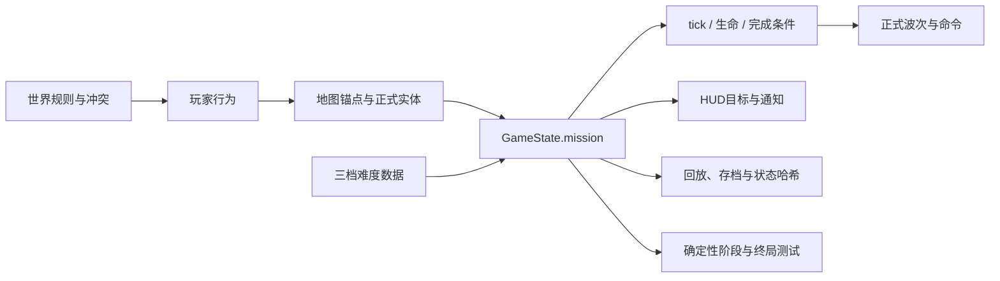
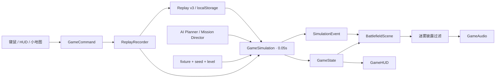

# 《断层战线》技术实现、任务编排与 Blender 资产流水线

更新时间：2026-08-10  
适用版本：v0.6.0 桌面 Web 垂直切片

## 1. 文档目的

本文回答三个具体问题：

1. 这款游戏的世界观、任务节奏和“剧情”是怎样规划并落到可玩规则中的？
2. 核心玩法、画面、界面、声音、存档、测试和发布分别使用了什么技术与工具？
3. 大模型怎样调度 Blender 生产模型，怎样保证输出不是一次性演示品，而是可编辑、可验证、可回退的正式游戏资产？

本文讲实现方法，不重复完整项目历史。阶段动作、问题和总体架构见[项目复盘与技术总览](project-retrospective-and-architecture.md)，当前对局结果见[黄金对局可玩性收口](golden-match-playability.md)。

## 2. 真实能力边界

当前版本实现的是一张地图、一条完整任务路线和三档难度的桌面 RTS 垂直切片，而不是完整剧情战役。它已经具备：

- 原创世界观、地图语义、任务简报、阶段目标、战场通知、增援、反扑、替代胜利和自然失败。
- 一局从经济整备到最终结算的确定性任务状态机。
- 可保存、可恢复、可镜像验证的任务进度。
- 由正式玩法单位执行的波次，不使用无敌、瞬移或只在画面中存在的脚本演员。

尚未实现的是：多关卡剧情树、人物对白系统、过场动画、任务编辑器、战役进度档案和分支结局。因此，本文所说的“剧情”更准确地叫做**系统化任务叙事**：地图、目标、压力、事件与玩家操作共同讲述一场战役。

设计文档中的“赫利俄斯防卫军 / 游隙联合体”仍是完整产品的世界观与阵营愿景；当前垂直切片在权威状态中只有 `player / enemy / neutral` 队伍，并以镜像规则验证核心闭环。不能把第二个完整非对称势力误报为已经落地。

## 3. 剧情与任务是怎样规划的

### 3.1 先确定世界规则，而不是先写过场

世界观给玩法提供原因：断层事件使地表析出可储能的“辉晶”，旧能源网络崩溃，工业化幸存势力围绕基地核心、资源田与远程信标争夺秩序。由此直接得到玩家可操作的六个动词：

1. 侦察资源和敌情。
2. 采集辉晶。
3. 建立电力与指挥网络。
4. 建造防御和生产设施。
5. 组织联合兵种推进。
6. 摧毁敌方核心或控制中央信标。

这一步的主要产物是[原创游戏设计方案](faultline-front-game-design.zh-CN.md)。它定义世界、阵营幻想、核心循环、地图尺度和原创边界，但不直接控制运行时。

### 3.2 把叙事节拍转换成玩家行为

“突破灰烬环线”没有先写成长对白，而是先写成一条玩家行为曲线：

| 叙事节拍 | 玩家行为 | 权威条件 | 战场反馈 |
| --- | --- | --- | --- |
| 战前整备 | 卸矿、建塔、生产载具 | 发生玩家卸矿记录；一座玩家哨戒塔完工；出现正式生产的玩家战斗载具 | 三项目标进度、任务提示、生产和施工表现 |
| 突破前沿 | 选择编队并移动攻击敌方双塔防线 | 整备三条件完成后进入；达到最短时长且防线生命低于阈值，或达到最长时长 | 双塔完整度、移动攻击引导、火炮和防御塔交战 |
| 装甲反扑 | 保持阵型并消耗敌军波次 | 从敌方正式工厂生成难度对应反扑编成 | 危险通知、正式单位从工厂方向进入战区 |
| 友军增援 | 接应并重新组成联合编队 | 反扑/防线被消耗或达到阶段上限 | 玩家正式工厂生成增援；中央信标提前开放 |
| 最终攻坚 | 摧毁核心或占领信标 | 进入指挥阶段；若拖延，最终敌军攻势指向玩家总部 | 核心情报、信标进度、终局警报与自然胜败 |

这样做的好处是，每段叙事都必须回答“玩家现在具体做什么、系统怎样知道他完成了、失败时怎样继续”。不能只写“敌军发动反扑”，却没有生成位置、目标、时间窗和结束条件。

### 3.3 用稳定地图锚点承载故事

地图由 `src/game/level.ts` 生成，保持单一 160×160 米 XZ 平面。任务使用稳定 ID 和位置，例如玩家/敌方工厂、双塔前沿、双方总部和中央信标。道路、资源区、战损地标和基地入口用于说明“这里发生过什么、下一步应该往哪里走”，但视觉道具不会偷偷改变权威碰撞。

关卡数据遵循三个约束：

- 目标、生产点、波次来源和胜败建筑都有稳定 ID。
- 视觉地标与权威阻挡分开；只有明确登记的 blocker 才影响导航。
- 所有单位、建筑、资源、目标和导航仍在同一玩法平面，避免 3D 画面与规则不一致。

### 3.4 任务导演是确定性状态机

`src/game/simulation.ts` 中的任务导演读取 `GameState.mission`，阶段固定为：

```text
deployment → frontline → counterattack → reinforcement → command → complete
```

其中 `complete` 是胜负结算后的终局标记，不是第六个可操作阶段。

它只读取模拟 tick、权威实体和任务状态，不读取浏览器时间、镜头位置、帧率或粒子效果。每 0.05 秒固定步进中，任务导演会：

- 检查整备条件和前线防御生命比例。
- 按难度读取最短/最长阶段时间。
- 从存活的正式工厂生成正式单位；工厂不存在时才回退到总部。
- 给波次下达正式 `attackMove`，让其继续使用寻路、视野、伤害、碰撞和死亡规则。
- 把波次 ID、阶段和阶段开始 tick 写回权威状态。
- 最终通过总部摧毁或信标控制进入正式胜败结算。

标准难度的当前数据是：前沿阶段至少 180 秒、最多 280 秒，双塔总生命降至 56% 可进入反扑；反扑至少 150 秒、最多 230 秒；增援阶段 150 秒；最终攻坚拖延 180 秒后生成一次指向玩家总部的最终攻势。通用扩张 AI 在可玩突破战中关闭，节奏由任务导演的正式波次负责。



### 3.5 难度不是运行时随意乘倍率

`src/game/difficulty.ts` 将新兵、标准、老兵定义为三套纯数据配置。每套配置明确包含：

- 初始双方耐久倍率。
- 敌方总部与前线防御生命比例。
- 反扑、增援和最终攻势的正式单位编成。
- 各阶段最短/最长时间和触发阈值。
- 任务波次耐久倍率与最终压力到达时间。

三档难度使用不同的规范 fixture。保存和回放记录 fixture 与 seed，因此难度属于对局身份，而不是中途热切换的隐藏倍率。这避免了“存档写着标准，恢复后却按老兵结算”的状态分裂。

### 3.6 HUD 是任务叙事的一部分

`src/ui.ts` 从权威任务状态生成阶段标题、具体操作、剩余单位、双塔完整度、信标进度和敌方核心情报。部署阶段的任务项还能把玩家直接带到防御或载具生产页。

任务简报和操作指南打开时会进入战术暂停：模拟 tick 和镜头输入停止，关闭后不会补跑丢失的时间。这样玩家阅读剧情/目标时不会在后台损失部队。

### 3.7 用确定性测试保护“剧情”

任务不是靠截图证明完成，而是同时验证：

- 阶段只能按既定顺序推进。
- 相同 seed 和命令在镜像实例中产生相同阶段、波次 ID 和状态哈希。
- 正确代表路线在目标窗口自然胜利。
- 严重弃守在难度对应窗口自然失败。
- 总部胜利与信标替代胜利都走正式结算。
- 保存后重建到目标 tick，阶段和结果保持一致。
- 专用胜利/失败/review fixture 可以在浏览器中快速复验结果页和表现。

因此，新增剧情时不只需要文案，还必须新增状态、触发、恢复和终局测试。

当前 seed 1949 的标准代表流程约 9 分钟自然胜利，验收目标为正确路线 8–12 分钟；这不是不依赖玩家操作的硬时间线。严重弃守的标准失败窗口更晚，不能把所有操作都描述成固定 9 分钟结束。

## 4. 核心技术与工具分工

| 范围 | 技术/工具 | 在项目中的职责 |
| --- | --- | --- |
| 产品与任务设计 | Markdown 规范、稳定关卡数据、确定性 review fixture | 定义目标、节拍、地图锚点、验收和原创边界 |
| 玩法核心 | TypeScript 5.9 strict | 单位、建筑、经济、电力、带宽、科技、任务、AI、视野和胜败的纯数据规则 |
| 游戏循环 | 自研 20Hz 固定步进模拟 | 帧率与玩法解耦；同输入可以重现 |
| 导航 | 确定性网格 A* + 编队槽位 + 局部避让 | 多单位绕障、编队行进和最终落点 |
| 敌方决策 | 五状态纯函数 AI Planner | 经济、集结、进攻、防守、恢复；黄金任务由专用导演接管节奏 |
| 3D 运行时 | Three.js r179 / WebGL | 正交战场、GLB、PBR、阴影、拾取、迷雾、LOD、实例化和 VFX |
| UI | 原生 DOM + CSS + Canvas | 右侧指挥栏、生产、任务、简报、结果、小地图和无障碍焦点 |
| 声音 | Web Audio API | 程序化命令/战斗反馈、空间声像、节流和静音；不进入权威状态 |
| 模型制作 | Blender 4.5.12 LTS + Python `bpy` | 参数化几何、可编辑母版、骨架/节点、预览和 GLB 导出 |
| 模型交付 | glTF/GLB、glTF Transform、Khronos `toktx` | 运行时格式和 KTX2 纹理压缩 |
| 资产校验 | Python GLB 解析器 + mutation tests | 锁定节点、父子关系、TRS、材质/纹理、三角形、primitive 和动画预算 |
| 自动测试 | Vitest | 模拟、回放、AI、任务、导航、UI 纯函数和场景生命周期回归 |
| 浏览器验收 | 确定性 URL fixture + 本地浏览器检查 | 在实际战略镜头验证模型、交互、console 和绘制指标 |
| 构建发布 | Vite 7 + PowerShell | 生产构建、本地 ZIP、manifest、逐文件 SHA256 和回滚资料 |
| 大模型/Codex | 需求拆解、脚本/代码生成、审计、测试编排 | 作为开发与制作流程的控制者；不是游戏运行时依赖 |

开发阶段还使用了并行子任务：玩法数据、Blender 资产、Three.js 接入、浏览器 QA 和文档审计可以并行，但同一关键文件在同一时刻只安排一个写入者。只读审计可以并行；进入浏览器验收前必须冻结运行时代码，避免热更新把正在测试的对局重置。大模型的协作记录不会随游戏发布，最终产品只依赖仓库中的代码、资产和构建产物。

## 5. 核心运行时怎样协作

玩家的外部操作先转换成 `GameCommand`。`ReplayRecorder` 只记录模拟接受的命令，`GameSimulation` 在固定 tick 内推进规则，再把 `GameState` 和 `SimulationEvent` 交给画面、HUD 与声音。



最重要的边界是：**模拟决定事实，表现只展示事实。** Three.js 模型、粒子、门动画、音效和 HUD 不会反向改写生命、资源、位置、任务或胜败。隐藏敌军事件也要先通过场景披露过滤，才允许触发可听声音，避免声音泄露战争迷雾情报。

## 6. 大模型如何调度 Blender

### 6.1 不是“把一句话直接变成最终模型”

本项目采用的是“语言模型控制可重复制作管线”，而不是黑盒文字转 3D：

1. 人与大模型先确定资产职责、战略镜头轮廓、真实尺寸、朝向、材质语言、三角形/primitive/纹理预算。
2. 大模型编写或修改项目内 Blender Python 生成器。
3. 命令行以后台模式启动 Blender，由 Blender 自己执行 `bpy` API。
4. Blender 输出 `.blend`、原始 `.glb` 和标准预览 PNG。
5. 人与大模型检查预览、解析指标和运行时 fixture，必要时修改生成规则并重建。
6. 通过合同、压缩、完整资产库验证后，候选才晋升到游戏发布目录。

概念图或图像生成结果只用于方向、色彩和轮廓讨论，不会被宣称为直接转换出的游戏网格。正式几何来自项目内原创的参数化规则、Blender 建模和可编辑母版。

### 6.2 本机 Blender 与调用方式

自动化使用 E 盘便携版 Blender，避免继续占用 C 盘：

```text
E:\0808_codex_project\.tools\blender\blender-4.5.12-windows-x64\blender.exe
```

生成单件资产的 PowerShell 调用示例：

```powershell
$blender = ".\.tools\blender\blender-4.5.12-windows-x64\blender.exe"
& $blender --background --python tools\blender\build_ff_asset_family.py -- ff_art_01
```

一次重建指定小批资产：

```powershell
& $blender --background --python tools\blender\build_ff_asset_family.py -- ff_art_01 ff_sup_01 ff_sct_01
```

英雄主战坦克使用独立入口：

```powershell
& $blender --background --python tools\blender\build_ff_mbt_01.py
```

六类步兵的共享骨架与动作升级使用另一个入口：

```powershell
& $blender --background --python tools\blender\upgrade_ff_infantry_rig_family.py -- `
  ff_rif_01 ff_eng_01 ff_at_01 ff_en_rif_01 ff_en_eng_01 ff_en_at_01
```

脚本参数 `--skip-preview` / `--skip-sprites` 可用于只做中间构建，但正式发布波次必须重新生成并检查标准预览。`build_ff_asset_family.py` 没有传资产 ID 时会遍历其余 41 件注册资产；坦克独立生成器负责第 42 件。全量生成耗时更长，日常修改应优先使用小批目标。

### 6.3 生成器内部做了什么

主生成器是 `tools/blender/build_ff_asset_family.py`，坦克还有独立的 `build_ff_mbt_01.py` 与骨骼升级脚本。主生成器的流程是：

1. `read_factory_settings(use_empty=True)` 清空 Blender 场景，避免上一个资产污染下一个资产。
2. 通过 `box`、`cylinder`、`torus`、楔形体、骨架和材质辅助函数构建确定性几何。
3. 建立稳定根节点和语义 Empty，例如 `chassis_root`、`turret_yaw`、`barrel_pitch`、`muzzle_socket`、`production_socket`、`deposit_socket`、`selection_anchor`。
4. 在节点 `extras` 中写入 `asset_id`、`asset_role`、`socket_role`、预算、轮廓版本、默认显隐和运行时所有权。
5. 添加固定棚拍地面、正交相机和灯光，执行 UV 处理。
6. **先保存可编辑 `.blend` 母版**，再对运行时副本做合并，避免为了低 draw call 破坏源文件的可编辑性。
7. `consolidate_runtime_asset()` 按“最近的运行时运动父节点 + 材质”合并网格；炮塔、炮管、门、雷达、吊机、受损层和废墟不会被错误吞回静态根。
8. 以 Y-up、保留 extras 的 GLB 2.0 格式导出。
9. 用 EEVEE Next、AgX 和固定 768×768 机位渲染标准预览。
10. 若资产含状态层，再渲染 `_wreck`、`_unload`、`_damaged`、`_critical`、`_ruin` 等独立预览。

三个入口各有明确分工：

- `build_ff_mbt_01.py` 负责英雄主战坦克、18 张 512² PBR 源纹理、1024² 预览以及可选 8 方向车体/16 方向炮塔精灵。方向精灵只是未来 2.5D 管线证明，当前游戏仍直接渲染 GLB。
- `build_ff_asset_family.py` 负责其余 41 件车辆、步兵静态源、建筑、资源和场景道具，标准预览为 768²。
- `upgrade_ff_infantry_rig_family.py` 打开六件步兵的 `_v1_source.blend`，建立 27 关节共享骨架并只导出 `idle / run / aim / fire / hit / death` 六段动作。把静态母版保留为 `_source.blend` 目前仍是人工步骤，不是自动生成器的一部分。

当前盘点为 42 个资产目录、42 个 raw GLB、42 个 public GLB、48 个 `.blend`（多出的 6 个是步兵静态 source）、72 张标准/状态预览，以及 18 张共享 PBR 源纹理 PNG。

每个资产通常得到：

```text
assets/3d/<asset_id>/
├─ <asset_id>_v1.blend
├─ <asset_id>_v1.glb
├─ <asset_id>_v1_preview.png
└─ <asset_id>_v1_<state>_preview.png   # 仅适用于相应状态
```

### 6.4 语义节点为什么是核心技术

GLB 不只是“可显示网格”，也是画面与玩法之间的表现接口。典型合同包括：

| 节点 | 用途 |
| --- | --- |
| `muzzle_socket` / `muzzle_socket_left/right` | 炮口火光、弹道起点、双管稳定轮换 |
| `turret_yaw` / `barrel_pitch` | 炮塔水平瞄准和炮管俯仰 |
| `production_socket` / `infantry_spawn` | 车辆/步兵出厂表现起点 |
| `deposit_socket` / `resource_socket` | 采矿车到精炼站的卸矿束和机械动作 |
| `factory_door` / `barracks_door` | 真实生产进度与出厂事件驱动的门 |
| `damage_socket_*` | 低生命烟火与受损反馈位置 |
| `damage_visual_damaged/critical` | 受损/濒危实体几何层 |
| `wreck_visual_root` / `ruin_visual_root` | 销毁后的专属残骸或建筑废墟 |
| `selection_anchor` / `ground_anchor` | 选择、接地和战略镜头对齐 |

如果只改网格外观而让炮口离开 `barrel_pitch`、让门被合并到静态建筑，画面仍可能“看起来像模型”，但运行时会开错枪、门不动或特效漂移。因此语义父子关系、局部 TRS 和 extras 必须像 API 一样管理。

## 7. 从候选资产到正式运行时资产

### 7.1 先在原始资产上执行合同验证

`tools/validate_glb_contracts.py` 直接解析 GLB，检查：

- 必需节点、唯一性、父子关系和局部平移/旋转/缩放。
- `socket_role`、`presentation_role`、默认显隐和运行时所有权。
- 材质、纹理、图像、动画、Skin、primitive 和三角形预算。
- 受损、濒危、残骸和废墟的精确部件数量。
- KTX2 发布物中的 `KHR_texture_basisu` 与图像格式。

`tools/test_validate_glb_contracts.py` 还会主动制造错误变体，确认校验器能拒绝炮口换父节点、socket 翻轴、门被静态合并、材质数超限等回归。只有“正确文件通过、被破坏的文件确实失败”，合同才可信。

### 7.2 在隔离目录做 KTX2 压缩

压缩脚本不会直接覆盖正式目录。它要求输入和输出不同，先在 `.tmp` 候选目录生成：

```powershell
powershell.exe -NoProfile -ExecutionPolicy Bypass `
  -File tools\compress_glb_ktx2.ps1 `
  -InputDir ".tmp\complete-candidate-raw" `
  -OutputDir ".tmp\candidate-ktx2"

python tools\validate_glb_contracts.py .tmp\candidate-ktx2 --require-ktx2
```

输入目录必须先组装为一个平铺的完整 42 件候选集：从当前 public 基线复制全部文件，再用本轮 raw GLB 覆盖目标项。压缩脚本只扫描输入目录顶层，不会递归 `assets/3d/<asset_id>`，也不会自动把候选晋升到 public。无纹理 GLB 只会被重新打包，不会凭空产生 KTX2 图像。

实际槽位策略是：

- `normalTexture`：UASTC level 2、RDO 0.5、Zstd 18，优先保留法线质量。
- `baseColorTexture` 与 `metallicRoughnessTexture`：ETC1S quality 180，降低下载和显存传输成本。

这里不应误写成完整 ORM/occlusion 打包；当前发布脚本处理的是 BaseColor、Normal 和 MetallicRoughness 槽。

### 7.3 发布、全库验证与回滚

正式波次遵循以下顺序：

1. 把旧 `.blend`、原始 GLB、预览和 public GLB 备份到 `.tmp/<wave>-before-*`。
2. 只生成目标资产的 raw 候选和预览。
3. 人工检查标准战略机位，解析三角形、primitive、材质、纹理和节点。
4. 在隔离目录压缩目标候选。
5. 将候选与其余正式资产组成完整 42 件候选库，再跑全库合同。
6. 仅在全部通过后晋升到 `public/assets/models`。
7. 再次执行正式目录合同、mutation tests、TypeScript 测试、生产构建和对应浏览器 fixture。
8. 记录新旧指标、SHA256、来源和备份路径到 `docs/asset-provenance.md` 与专项文档。

当前真值是：42/42 GLB 资产合同通过；其中 17 件包含纹理并满足 KTX2/KHR_texture_basisu 合同，25 件使用无贴图 PBR。KTX2 是纹理的 GPU 友好交付容器，不会自动改善模型造型；它主要减少下载体积，并允许浏览器按当前 GPU 支持格式转码后上传，从而控制多平台纹理交付成本。

## 8. 资产怎样进入 Three.js 游戏

`src/game/asset-dependencies.ts` 将单位/建筑类型映射到稳定资产 ID，并按场景制定加载计划：

- 聚焦评审只加载 2–12 件目标资产。
- 黄金突破战把首屏和未来正式波次所需资产纳入 critical 计划。
- 关卡岩石/矿床进入 level 阶段。
- 弹坑、残骸、路标和植被进入延后 dressing 阶段。
- 玩家新建或生产尚未加载的类型时走 ensure 请求。

`src/game/scene.ts` 动态加载 GLTFLoader、KTX2Loader 和 SkeletonUtils，限制并发、失败最多重试一次，并保留程序化回退。材质以“资产所有者 + 描述签名”隔离，避免不同 GLB 中同名材质互相串贴图。正式 GLB 到达后可以原位替换回退模型，不改变权威单位。

突破战按 `critical(4 路并发) → level(3 路) → dressing(2 路延后)` 加载；普通关卡通常为 4 路，后续生产/建造幽灵的 `ensure` 为 2 路。加载账本记录 queued、inflight、loaded、failed 和 attempts，单件最多尝试两次，最终失败不会无限重试。

运行时随后按语义节点驱动炮塔、炮管、门、雷达、吊机、卸矿、出厂、受损、残骸和废墟。LOD、阴影裁减、动画降频和实例化只改变呈现成本，不进入模拟状态。

## 9. 一次完整资产波次的标准动作

以“重制一辆支援车辆”为例：

1. 在真实 1440×900 战略镜头确认问题是轮廓/比例，而不是灯光、UI 或错误材质。
2. 记录旧 public/raw SHA、三角形、primitive、材质、纹理、节点、socket 父子与 TRS。
3. 写发布上限，例如 `≤2600 triangles / ≤12 primitives / ≤7 materials / 0 new textures`。
4. 备份旧母版、GLB 和预览。
5. 修改 Blender 生成器的大体块和功能结构，保留资产 ID、朝向、接地点与语义节点。
6. 后台重建单件资产并检查 768² 预览。
7. 用解析器比较旧/新稳定节点，要求关键 parent/TRS/extras 零漂移。
8. 运行原始合同和 mutation tests。
9. 在隔离目录生成 KTX2 候选并验证。
10. 合入 42 件完整候选库验证，再晋升 public。
11. 打开专用浏览器 fixture，检查模型身份、炮口、动画、接地、console 和绘制预算。
12. 记录 provenance、SHA 和回退目录；失败时回退整个目标集合，不混用半批新旧文件。

## 10. 自动化与人工判断的边界

### 已经适合自动化

- 参数化大体块、重复结构和统一材质创建。
- 节点命名、socket、父子、TRS 和 extras。
- 多状态预览、GLB 导出和 KTX2 压缩。
- 三角形/primitive/材质/纹理预算。
- 资产依赖、加载重试和程序化回退。
- 确定性任务推进、回放哈希和镜像测试。
- 发布清单、SHA256 与 ZIP 自校验。

### 仍然需要人判断

- 战略镜头下是否一眼能分辨职业和阵营。
- 模型比例、明度、剪影、接地和入口是否自然。
- 任务提示是否让陌生玩家知道下一步，而不是只在测试里“能完成”。
- 交战节奏是有压力还是拖沓，正确路线和失败路线是否合理。
- 视觉细节是否值得真实加载、draw call 和维护成本。
- 参考经典 RTS 的信息结构是否已经越过原创边界。

因此，大模型的最大价值是：把标准、脚本、验证和迭代连接成高吞吐的可重复流程；它不能替代美术指导、游戏设计判断和真实玩家测试。

## 11. 当前还可改进的实现债务

- `GameState.mission` 目前只有反扑与增援两组波次 ID；最终攻势会复用并追加到反扑 ID。后续扩展更多剧情事件时，应拆出 `finalAssaultUnitIds` 和显式任务 flags。
- HUD 当前通过波次数量推断最终攻势是否已调度；老兵初始反扑人数较多，存在短暂误判文案的可能。权威玩法不受影响，但应改为读取显式状态。
- 步兵 `_v1_source.blend` 的保留/复制仍是人工步骤，应由生成脚本自动生成并校验来源关系。
- 候选晋升 public 目前没有单一自动 promotion 命令，依赖范围明确的备份、复制和复验；适合在建立 Git 与 CI 后固化为事务化发布脚本。
- 源码现已纳入 Git，并用 Git LFS 管理 Blender 母版；`.tmp` before 备份仍只作为开发期短期保险。后续应由 CI 把源码提交、资产合同与发布包绑定到同一版本标签，并将发布 ZIP 作为制品而非源码提交。

## 12. 新增任务或资产时的最低合同

### 新任务

- 明确玩家动词、稳定目标 ID、进入/退出条件、超时策略和胜败出口。
- 阶段数据必须进入 `GameState` 与状态哈希。
- 波次必须使用正式单位与正式命令。
- HUD 文案必须能回答“现在做什么、进展如何、失败后怎么办”。
- 至少有阶段顺序、镜像哈希、保存恢复、自然胜/败和浏览器入口测试。

### 新资产

- 先有角色、尺寸、前向、pivot、战略轮廓和性能预算。
- 必需 socket/运动节点先定义，再建网格。
- 输出可编辑 `.blend`、raw GLB、标准预览和来源记录。
- 在候选目录验证，不能直接覆盖 public。
- 必须有程序化回退或明确的失败边界。
- 必须在实际游戏镜头和对应 fixture 验收，不以 Blender 棚拍代替游戏证据。

## 13. 关键文件入口

| 主题 | 文件 |
| --- | --- |
| 世界观与产品方向 | `docs/faultline-front-game-design.zh-CN.md` |
| 当前黄金任务 | `docs/golden-match-playability.md` |
| 三档难度与入口 | `docs/breakthrough-difficulty-deployment.md` |
| 初始关卡与稳定锚点 | `src/game/level.ts` |
| 任务导演与权威模拟 | `src/game/simulation.ts` |
| 难度纯数据 | `src/game/difficulty.ts` |
| 任务 HUD | `src/ui.ts` |
| 命令回放与保存 | `src/game/replay.ts`、`src/game/saved-deployment.ts` |
| Blender 主生成器 | `tools/blender/build_ff_asset_family.py` |
| 坦克生成器 | `tools/blender/build_ff_mbt_01.py` |
| 步兵共享骨架升级 | `tools/blender/upgrade_ff_infantry_rig_family.py` |
| 纹理压缩 | `tools/compress_glb_ktx2.ps1` |
| GLB 合同 | `tools/validate_glb_contracts.py` |
| 合同变异测试 | `tools/test_validate_glb_contracts.py` |
| 资产目录与加载计划 | `src/game/asset-dependencies.ts` |
| Three.js 资产运行时 | `src/game/scene.ts` |
| 资产来源真值 | `docs/asset-provenance.md` |

## 14. 结论

项目的核心技术不是某一个模型或某一个界面，而是三条可相互验证的流水线：

1. **叙事流水线**：世界规则 → 玩家行为 → 地图锚点 → 确定性阶段 → 正式波次 → HUD/胜败/存档。
2. **资产流水线**：美术与语义合同 → Blender Python → 可编辑母版/GLB/预览 → 合同/KTX2 → 分阶段加载与运行时表现。
3. **质量流水线**：纯数据模拟 → 自动化测试 → 确定性 fixture → 真实浏览器验收 → 可回滚发布包。

这也是大模型在本项目中真正有效的用法：不是一次生成“看起来像游戏”的结果，而是持续控制一套能重建、能测量、能回退、能交付的游戏生产系统。
