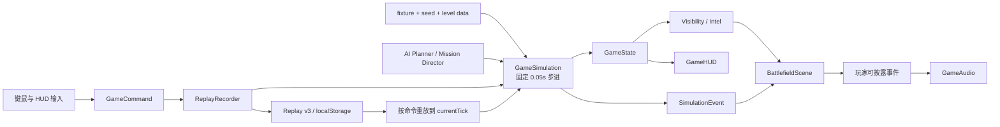
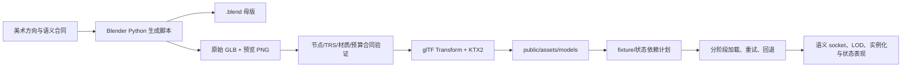

# 《断层战线》项目复盘与技术总览

更新时间：2026-08-11
当前版本：v0.6.0  
交付形态：桌面 Web 可玩垂直切片、本地可验证发布包、GitHub Pages 公网演示

## 1. 执行结论

项目最初的目标，是在浏览器中做出一款操作和信息节奏接近经典基地建设 RTS、但地图、模型、界面、文字、声音与世界观均保持原创的游戏原型。经过多轮实现与纠偏，目前已经完成：

- 一局从基地整备开始、以摧毁敌方核心或占领信标结束的完整桌面 RTS 对局。
- 采集、资源、电力、带宽、建造、生产、科技、取消退款、视野、雷达、编队、战斗、AI、胜败和重开闭环。
- 新兵、标准、老兵三档确定性难度；标准代表流程约 9 分钟，整体目标区间为 8–12 分钟。
- 本地保存、载入和从根任务简报继续上次战况；存档按场景、种子和模拟刻严格校验。
- 42 件原创 Blender/GLB 运行时资产、语义挂点、实体受损、施工、出厂、卸矿、残骸和废墟表现。
- 参考经典 C&C/RA2 信息架构的桌面右侧指挥栏，同时保持原创视觉与版权边界。
- 33 个测试文件、333 项自动化测试、42/42 GLB 资产合同（其中 17 件有纹理资产满足 KTX2 合同）、生产构建、本地发布包和 GitHub Pages 自动部署。

因此，**“完成一个可以开始、理解、操作、保存并打到结算的桌面 RTS 垂直切片”这一阶段目标已经达成**。

尚未达成的是商业完整游戏的内容规模：多张正式地图、完整双阵营可玩内容、战役关卡组、多人联机、长期进度、正式配乐/配音及大量人工精修资产仍属于后续产品阶段。

## 2. 最初目标与约束

### 产品目标

- 让玩家第一眼看到的是可操作战场，而不是文档、控制面板或静态模型陈列。
- 采用经典 RTS 的左键选择、右键情境命令、框选、编队、移动攻击、基地建设与侧栏生产语法。
- 以《红色警戒 2 / 尤里的复仇》作为操作层级和桌面信息结构参考，但不复制其商标、图像、音频、角色或模型。
- 先完成一张平面战场上的稳定闭环，再扩展地图、势力和内容。

### 实施边界

- 桌面键鼠和 WebGL 为当前发布面，手机端不是交付阻塞项。
- 无后端、无账号、无付费服务；存档保存在当前浏览器。
- 所有权威玩法都发生在 XZ 平面，地面高度固定为 Y=0。
- 模拟必须固定步进、可回放、同种子同命令得到相同结果。
- 资产优先使用原创程序几何、Blender 脚本和可验证 GLB，不依赖下载来的商业模型。

完整设计边界见[游戏设计方案](faultline-front-game-design.zh-CN.md)和[交付契约](prototype-delivery-contract.md)。

## 3. 从开始到当前目标的演进

项目在主要开发完成后的 2026-08-11 才建立 [GitHub 仓库](https://github.com/yydshly/0810-faultline-front)。因此此前阶段仍是根据版本契约、文件记录和验收证据还原的逻辑时间线，不冒充不存在的提交级历史；资产与任务工作曾并行推进，并非完全串行的瀑布流程。

| 阶段 | 当时的核心问题 | 主要动作 | 阶段结果 |
| --- | --- | --- | --- |
| 0. 产品定义 | “类似红警”容易变成无限范围或直接模仿 | 明确原创世界观、桌面 Web、单地图垂直切片、平面玩法和操作参考边界 | 建立可执行的设计与交付契约 |
| 1. 灰盒闭环 | 只有想法，没有能玩的战场 | 搭建 Vite、TypeScript、Three.js；实现选择、移动、攻击、采集、建造、生产、AI 和胜负 | 第一版可运行 RTS 模子成立 |
| 2. v0.2 确定性核心 | 编队拥挤、绕障弱、无法可靠保存 | 加入网格 A*、稳定编队槽位、工兵维修、炮兵溅射、五状态 AI、命令日志回放 | 同种子与命令可以稳定重现 |
| 3. v0.3 情报与运营 | 隐藏敌军泄漏、科技和取消不完整 | 加入双方独立战争迷雾、雷达、三项科技、施工/生产/研究取消与 75% 退款 | 经济、情报和科技闭环成立 |
| 4. v0.4 防御与声音 | 基地缺少防守层，动作反馈偏弱 | 加入哨戒塔、重炮塔、供电/联网停机、自动索敌、程序化 Web Audio | 防守玩法和声音反馈成立 |
| 5. v0.5 UI 重构 | “已有模子，但 UI 很差”，面板遮挡战场 | 重做信息层级、抽屉、标签页、焦点、键盘与响应式结构 | 战场重新成为首要视觉焦点 |
| 6. v0.6 经典桌面指挥栏 | 操作结构仍不像经典 C&C/RA2 | 桌面改为左战场 + 316px 右侧连续指挥栏，拆分建筑/防御/步兵/载具四类生产 | 操作管理方式达到目标参考 |
| 7. 资产与视觉金标 | 盒体模型、地表和矿床缺乏一致性 | 建立 Blender 程序资产族、PBR/KTX2、语义节点、视觉评审夹具和资产合同 | 42 件原创资产形成统一家族 |
| 8. 表现与性能 | 资产加载不稳定、材质串用、绘制调用过高 | 修复材质所有权，分阶段加载，加入 LOD、实例化、生命条批处理、VFX 预算与回退 | 高画质突破战峰值绘制调用显著下降 |
| 9. 黄金对局 | 既有五阶段展示路线以十单位即时突击起步，约数分钟结束，经济和生产缺少意义 | 在既有五阶段导演上重编开局与节奏；加入真实整备门槛，保留并重调反扑、增援、信标替代胜利与终局攻势 | 形成约 9 分钟可重复完成的完整对局 |
| 10. 难度、续战与发布 | 只能从固定路线开始，跨页面继续不完整 | 加入三档难度、任务简报、严格存档摘要、一次性续战恢复、确定性失败回退和本地发布包 | 垂直切片达到可交付状态 |

## 4. 我们实际做了哪些工作

### 4.1 玩法与模拟

- 定义单位、建筑、资源、信标、经济、科技、任务和情报的纯数据状态。
- 将玩家外部操作统一为 `GameCommand`，包括移动/攻击、建造、生产、研究、维修和取消；战斗结算与任务波次由固定 0.05 秒模拟内部推进。
- 实现采矿车采集/返矿、建筑施工、单位生产、电力、带宽、网络覆盖和研究进度。
- 实现步兵、轻甲、重甲、建筑克制，炮弹飞行、重炮溅射、维修与防御塔自动索敌。
- 实现网格 A*、编队槽位、局部避让和中间路径点容差。
- 实现五状态 AI，以及黄金对局专用任务导演、波次和终局压力。
- 通过稳定排序、固定 tick 和状态哈希保证同一输入可复现。

### 4.2 情报、存档与任务

- 为双方分别维护“当前可见 / 已探索 / 未知”网格。
- 将选择、攻击、小地图、AI 目标和声音事件全部接入披露边界，避免战争迷雾泄漏。
- 以 `fixture + seed + command log + currentTick` 保存战况，而不是直接序列化复杂运行时对象。
- 回放格式经历版本升级并采用严格字段校验；不兼容旧版本会明确拒绝。
- 加入五阶段突破战、三档难度、胜败结果、重新部署和跨页面继续上次战况。

### 4.3 UI、交互与无障碍

- 从早期多面板 HUD，逐步收敛为经典桌面右侧指挥栏。
- 将生产分为建筑、防御、步兵和载具四类，并保留费用、锁定原因、队列、进度和取消。
- 加入任务抽屉、操作指南、战术暂停、系统工具、画质、声音、保存和载入。
- 加入阵营一致的蓝/红标记、可读生命条、聚合多选卡和小地图镜头导航。
- 处理 `hidden + inert`、焦点循环/返回、Escape、键盘标签页、强制颜色和减少动态模式。
- 任务整备项成为可执行入口：自动卸矿说明、定位合法建塔区、直达载具生产和剩余时间。

### 4.4 地图、模型与资产流水线

- 将灰色工程网格替换为确定性土壤、道路、基地地坪、矿区侵蚀、工业地标和战损装饰。
- 使用大模型生成和维护 Blender Python 脚本，再由 Blender 无界面执行，批量生成可编辑母版、预览和 GLB。
- 这种方式并不是“大模型直接凭空产出最终高质量模型”，而是让模型控制可重复的建模规则、尺寸、材质、层级和语义节点，再通过预览、合同和浏览器镜头验收迭代。
- 为单位与建筑建立 `muzzle_socket`、生产出口、卸矿入口、受损点、残骸、废墟和阵营标记等语义合同。
- 使用 KTX2 压缩纹理，控制浏览器下载、GPU 上传和内存占用。
- 通过资产白名单与分阶段依赖计划，只加载当前场景真正需要的模型。

### 4.5 表现、性能与发布

- 加入正交镜头、画质分级、距离 LOD、视野外裁剪、动态阴影裁减和减少动态等价表现。
- 批处理突破战静态地表、接触阴影、群选环和生命条，减少绘制调用。
- 对弹道、命中、爆炸、烟火、焦痕、残骸和废墟设置独立数量上限、生命周期和清理路径。
- 建立 Vitest 自动化、确定性夹具、浏览器实机矩阵、GLB 合同验证和 KTX2 检查。
- 建立 PowerShell 本地发布脚本，生成含清单和逐文件 SHA256 的不可变时间戳 ZIP。

## 5. 关键问题、根因与解决方案

| 问题 | 根因 | 解决办法 | 结果 |
| --- | --- | --- | --- |
| 初版模型和地图像灰盒 | 程序盒体只验证功能，没有资产语言和镜头尺度标准 | 建立资产圣经、默认战略视距、中尺度轮廓规则和 Blender 程序资产族 | 地图、建筑、载具和步兵形成统一原创风格 |
| AI 很难直接“画好”3D 资产 | 文本模型不等于成熟人工美术，直接生成不可控且难以复现 | 让模型编写 Blender 生成脚本，以合同、预算、预览和人工镜头复核控制结果 | 资产可重复生成、可编辑、可验证，但仍诚实保留人工精修空间 |
| 已安装的 Blender 无法稳定后台自动化 | Microsoft Store 版本受 WindowsApps 权限限制，同时 C 盘空间紧张 | 将可自动化的 Blender 4.5 LTS 便携环境、资产母版和压缩过程放在 E 盘 | 解除了权限和磁盘阻塞，完整资产链不依赖 C 盘安装位置 |
| UI 面板过多且遮挡战场 | 信息层级不清，桌面和平板规则混杂 | 两轮 UI 审计后改为左战场/右指挥栏，次级信息进入抽屉，任务打开时暂停 | 第一眼重新聚焦战场，生产和资源路径稳定 |
| 敌我难区分、生命条发黑 | 阵营色散落在多个模块；独立生命条曾有黑底覆盖填充的 render order 问题，批处理后又出现实例材质 `vertexColors` 乘黑 | 统一 faction visual tokens，固定底板/填充/边框顺序，移除错误顶点色乘法，蓝/红用于标记与边框 | 三维战场、HUD 和小地图使用同一阵营语义 |
| 同名材质会随机串贴图 | 多个 GLB 的同名材质实际内容不同，并发加载顺序不确定 | 材质默认按资产 owner + 描述签名隔离，禁止仅按名称跨资产复用 | 冷/热缓存不再改变模型外观 |
| 聚焦评审曾沿用完整资产加载链，加载远超评审所需的模型 | 加载器缺少内容依赖和阶段概念 | 建立资产目录、评审白名单、critical/level/dressing/ensure 分阶段计划和重试账本 | 聚焦评审只请求 2–12 件必要资产，普通与突破场景按内容和阶段增量补齐 |
| 突破战绘制调用过高 | 每个生命条、影子、选择环和地表装饰都是独立对象 | 将稳定重复对象改为 InstancedMesh，生命条三层由 39 calls 合并为 3 | 同窗峰值由约 653 降到约 605，仍保留语义与拾取 |
| 战争迷雾边缘像硬切黑墙 | 64×64 显示层从透明直接跳到高不透明 | 只在显示采样增加两级边缘 alpha，不改变权威可见网格 | 过渡更自然且没有情报规则变化 |
| 销毁后死亡动画和残骸错型 | 权威模拟同 tick 删除实体，表现层丢失旧模型和类型 | 消费销毁事件前保留 previous visual；专属残骸/废墟优先，未知类型使用中性回退 | 步兵、轻车、重车、火炮和建筑不再共用错误坦克废铁 |
| 建筑施工时被纵向压扁 | 早期用整体 Y 缩放表达进度 | 改为地基、钢架、外壳三阶段共享实例，正式模型始终自然比例 | 施工可读且不扭曲资产 |
| 门、吊机、卸矿机构动画与真实进度不一致 | 表现层只看“队列是否存在”，没有观察进度变化 | 读取权威 remaining/buildProgress 和真实事件，用语义节点驱动门、输送和滚筒 | 停工、低电、取消和完成时的动作与状态一致 |
| 编队长期卡在同一中间路径点 | 所有单位必须进入 0.3m 才能换点，但大单位互相避让无法同时满足 | 中间 A* 点使用单位半径 + 导航余量 + 半格容差，最终落点仍保持 0.3m | 黄金路线可自然推进至敌方总部，最终精度不变 |
| 早期突破战两三分钟结束 | 开场送出完整军队、敌我零秒接战，经济和生产没有意义 | 改为三项真实整备门槛、驻防前线、阶段时间窗、反扑和增援 | 代表流程扩展为约 9 分钟完整对局 |
| 失败几乎不可能发生 | 反扑目标不是玩家总部，通用 AI 也无法形成攻家链 | 终局攻势绑定玩家 HQ，加入闲置压力；限制 AI 无意义中继扩建 | 正确路线可胜，严重弃守可自然失败 |
| 跨难度载入可能让场景/HUD身份分裂 | 场景、资产白名单和 HUD 在构造时绑定 fixture | 手动跨 fixture 明确拒绝；续战先导航到精确 fixture/seed，再在首帧前恢复 | 不会在错误迷雾或资产环境中热载入 |
| 恢复链接可能反复载入或遇到存档竞态 | URL 只有模糊“恢复”标记，跳转前后存档可能变化 | 一次性携带 `resume + resumeTick`，锁定 fixture/seed/tick；成功失败都清除 | 刷新不重复恢复，失效请求停在 00:00 新局简报 |
| 全量测试需要控制内存峰值 | Three.js、资产解析和多套测试并行会显著提高瞬时占用 | 完整门禁固定使用单 worker，定向测试先行，浏览器夹具隔离资产 | 验收基线更稳定，结果不受并发资源竞争干扰 |

## 6. 当前技术架构

### 6.1 技术栈

| 层级 | 技术 | 职责 |
| --- | --- | --- |
| 语言与构建 | TypeScript 5、Vite 7 | 类型安全、开发服务、生产打包 |
| 3D 渲染 | Three.js r179、WebGL | 正交战场、GLB、材质、动画、实例化、VFX |
| 玩法核心 | 自研固定步进模拟 | 经济、单位、建筑、AI、任务、胜负和事件 |
| UI | 原生 DOM + CSS | 右侧指挥栏、任务、生产、结果和无障碍 |
| 音频 | Web Audio API | 程序化提示、空间声像、节流、静音 |
| 资产制作 | Blender Python、glTF/GLB | 程序建模、母版、语义节点、预览与导出 |
| 纹理交付 | glTF Transform、KTX2/BasisU | BaseColor、Normal、MetallicRoughness 浏览器压缩 |
| 测试 | Vitest、确定性夹具、浏览器验收 | 纯函数、模拟、回放、场景契约和真实交互 |
| 发布 | PowerShell ZIP + SHA256 清单 | 可复现的本地静态站点发布包 |

### 6.2 运行时数据流

核心原则是：**模拟层决定事实，表现层只读取状态和事件**。Three.js、DOM、音频、粒子、门动画和残骸不会反向修改权威状态，因此视觉优化不会改变回放结果。

### 6.3 主要模块边界

| 模块 | 作用 |
| --- | --- |
| `src/game/types.ts` | 权威状态、命令、事件和实体类型 |
| `src/game/config.ts` | 单位、建筑、费用、时间、伤害和全局常量 |
| `src/game/level.ts` | 地图锚点、初始状态、评审夹具与黄金对局数据 |
| `src/game/simulation.ts` | 固定步进规则、命令执行、任务导演和胜负 |
| `src/game/pathfinding.ts` | 确定性网格 A*、净空和障碍 |
| `src/game/visibility.ts` | 双阵营当前可见/已探索网格 |
| `src/game/ai-planner.ts` | 经济、集结、进攻、防守、恢复五状态规划 |
| `src/game/technology.ts` | 科技队列、效果与取消退款纯函数 |
| `src/game/replay.ts` | 回放 v3、严格解析、命令记录和状态恢复 |
| `src/game/difficulty.ts` | 三档突破战配置与规范 fixture 映射 |
| `src/game/saved-deployment.ts` | 首局简报可用的严格存档摘要 |
| `src/game/asset-dependencies.ts` | 42 件资产目录、白名单、阶段加载和重试账本 |
| `src/game/scene.ts` | Three.js 场景、GLB、LOD、迷雾、特效和表现生命周期 |
| `src/game/audio.ts` | 事件到声音映射、解锁、节流、声部和静音 |
| `src/ui.ts` / `src/styles.css` | HUD、指挥栏、任务、对话框、焦点和桌面布局 |
| `src/main.ts` | 启动、输入、主循环、模块装配、存档与续战路由 |

### 6.4 确定性与存档边界

- 固定步长为 0.05 秒；渲染帧率只影响画面，不影响玩法 tick。
- 状态内不保存 Three.js 对象、DOM、音频节点或 wall-clock 时间。
- 命令按 tick 记录，回放从相同 fixture 和 seed 重建到目标 tick。
- 哈希使用稳定排序和普通 JSON 数据，验证镜像运行的一致性。
- 视觉画质、静音、粒子、动画节流和 LOD 不进入回放。
- 不同 fixture 的存档不热载入；不同难度拥有不同场景身份。

### 6.5 设计愿景与当前实际的差异

早期设计文档同时记录了中长期愿景。当前实现应以源码和本总览为准，不能把尚未落地的愿景写成现状：

| 早期愿景 | 当前实际 | 后续判断 |
| --- | --- | --- |
| React HUD | 原生 DOM、ARIA 与 CSS，项目运行依赖中没有 React | 当前规模可以继续使用；拆组件优先于迁移框架 |
| Web Worker 中的模拟 | 主线程 RAF 累加器，以 20Hz 固定步进推进，单帧最多补 5 tick | 低配实测显示主线程瓶颈后再迁移 |
| IndexedDB 与 3 个自动存档 | `localStorage` 单槽命令日志，从 tick 0 重放；长恢复每 300 tick 让出一帧 | 多槽和自动存档是下一阶段 P1 |
| 2.5D 车体/炮塔方向图集运行时 | 方向帧管线曾完成验证，但正式战场仍直接渲染 GLB | 不应误报为已切换精灵运行时 |
| 联机锁步与服务器权威 | 当前完全本地单人，无后端、账号或联网 | 只有单人 Alpha 稳定后才评估 |
| 公网静态演示 | GitHub Pages 只部署通过 Quality Gate 的精确 `main` 提交 | 已完成子路径资源修复、线上资产/简报/保存续战烟测；正式商业托管、自定义域与 SLA 尚未实施 |

### 6.6 资产生产与运行时加载

资产合同会锁定：资产身份、根节点、枢轴、父子关系、局部 TRS、材质/纹理数量、primitive/triangle 预算、动画、socket role、默认显隐和运行时所有权。这样可以重建视觉而不破坏炮口、门、雷达、出厂口、卸矿口、损伤点或残骸逻辑。

### 6.7 测试与发布结构

- 纯函数测试：路径、可见性、科技、难度、材质签名、LOD、UI 坐标等。
- 模拟测试：经济、战斗、建造、生产、AI、任务、自然胜败和镜像哈希。
- 回放测试：格式、严格字段、同 tick 命令顺序和目标 tick 状态哈希。
- 场景契约测试：VFX、实例化、受损、残骸、废墟、socket 和评审夹具。
- 资产测试：42/42 GLB 语义与预算合同；其中 17/17 有纹理资产满足 KTX2/KHR_texture_basisu 合同，25 件为无贴图 PBR；同时覆盖节点、材质、几何预算及变异拒绝。
- 浏览器测试：1440/1280 桌面交互、任务暂停、生产、终局、难度、续战和 console。
- 发布包：只读取已验证 `dist/`，生成 manifest、逐文件 SHA256 和整包 sidecar。

## 7. 当前规模与质量证据

截至 2026-08-11：

- 24 个非测试 TypeScript 文件（其中 1 个为 Vite 类型声明）、33 个测试文件，共 57 个 TypeScript 文件。
- 以 PowerShell `Measure-Object -Line` 的非空行口径计，非测试 TypeScript 约 18,361 行、测试约 4,652 行、CSS 约 4,397 行。
- 42 件运行时 GLB，其中 17 件含 KTX2 纹理、25 件使用无贴图 PBR 材质。
- 33 个测试文件、333 项测试全部通过。
- TypeScript 严格检查通过；Vite 生产构建 36 modules。
- Three.js 主分块 549.65 kB，是当前唯一非阻塞构建提示。
- 最终提交绑定包为 `faultline-front-prototype-v0.6.0-20260811T064551Z.zip`，SHA256 为 `9bd38f523ddaf2d5e2ea3569a2856b1c9e4679c9415427d3b0eea6770d5bb1b5`；manifest 锁定提交 `33a9122b72a13d1a3f4b1a571509f261f2ae656d` 与标签 `v0.6.0`。

最新可玩性证据见[黄金对局收口](golden-match-playability.md)，公开版本见 [GitHub Pages 部署与线上验收](github-pages-deployment.md)，最终包和回滚说明见[发布与部署就绪说明](release-readiness.md)。

## 8. 仍可优化的部分

当前没有已知阻止桌面垂直切片运行的 P0。后续优化应先提升真实玩家完成率和维护性，而不是继续无边界精修模型。

### P1：下一发布阶段优先

1. **全新环境与真人试玩**  
   用最终 ZIP 在干净浏览器和普通桌面电脑冷启动；邀请 3–5 名第一次接触项目的玩家，记录他们是否理解卸矿、建塔、生产、移动攻击、信标和终局。

2. **存档升级**  
   当前仍是全局单槽。建议拆分正式战役与评审存档，增加自动存档和 3 个手动槽位，并显示时间、难度、任务阶段和兼容状态。

3. **低配桌面性能门**  
   目前高画质激战仍可达到约 600 calls。应先在集显和较低端独显测量帧时间，再有证据地继续合批阴影、拆分特效或降低高档预算。

4. **真实浏览器自动化**  
   现有确定性夹具很强，但浏览器验证仍主要由人工/控制脚本执行。可将根简报、整备、保存续战、胜败和重开固化为正式端到端流水线。

5. **发布自动化与提交绑定**  
   源码仓库与版本标签已经建立，但现存 `unversioned-verified-dist` 包早于仓库初始化。下一步应由 CI 在干净提交上完成验证、生成 manifest、上传制品并保留基于提交和标签的回滚证据。

### P2：维护性与体验

1. **拆分表现层单体文件**  
   `scene.ts` 约 8,107 行，已经同时承担资产加载、迷雾、LOD、VFX、残骸、施工和评审指标。可按 `asset-loader / entity-visual / battlefield-vfx / construction / destruction / review-fixtures` 拆分，但必须保持当前纯函数测试和生命周期合同。

2. **拆分 UI 与样式层**  
   `ui.ts` 约 2,150 行、`styles.css` 约 4,397 行。可提取部署简报、生产侧栏、选择坞、结果页和设计令牌，减少后续改版的级联风险。

3. **代码分包**  
   Three.js 主分块 549.65 kB。可以把评审夹具、部分加载器扩展或非首屏工具动态导入；是否值得实施应以冷启动和缓存数据决定，而不是只为消除警告。

4. **真实低模层级**  
   当前已经有 LOD 判定、滞回、裁剪、阴影裁减和动画降频，但正式资产主要只注册 LOD0 几何。若低配实测确认 GPU/顶点压力，应为高频车辆和建筑制作真正的 LOD1/LOD2，而不是继续给 LOD0 增加细节。

5. **HUD 脏更新和关卡注册表**  
   HUD 目前随 RAF 频繁检查状态，fixture 的镜头、资产和特殊规则也分散在 `main.ts / level.ts / scene.ts`。可按资源、选择、任务和小地图建立脏标记，并把 fixture 元数据集中成注册表。

6. **声音与设置**  
   当前声音为程序化反馈。后续可加入战斗音乐状态、环境层、语音、主音量/音乐/效果分组、键位设置和震动强度，而不改变权威模拟。

7. **更多内容**  
   在首局真人完成率稳定后，再制作第二张地图、第二种任务结构和第二个完整可玩势力。不要在没有试玩证据时先扩张资产数量。

### 当前不建议优先做

- 为了追求截图细节继续大规模重制已经通过战略镜头验收的模型。
- 在没有帧时间证据时重写渲染架构或迁移引擎。
- 在单人闭环尚未经过外部试玩前投入正式多人联机。
- 同时扩地图、势力、科技树、战役和移动端，重新造成范围失控。

## 9. 关键经验

1. **“可玩”必须由完整玩家旅程定义，而不是由功能数量定义。** 早期虽然已有采集、建造和战斗，但直到黄金对局具备准备、推进、反扑、终局和自然失败，才真正形成游戏。
2. **资产质量首先取决于轮廓、比例和统一规则。** 战略镜头下，0.4–1.2m 的中尺度结构比微小划痕和大量独立贴图更有效。
3. **大模型适合控制可重复的制作流程，不等于替代所有人工美术。** Blender 脚本、合同、预览和浏览器验收让结果可控；最终艺术品质仍需要明确方向与人工判断。
4. **权威模拟和表现层必须分离。** 这使得迷雾羽化、生命条、VFX、残骸和 LOD 可以反复优化，而不会破坏回放和玩法。
5. **确定性夹具是长期开发的放大器。** 它们让复杂战斗、受损、施工、炮口和终局能够在几秒内稳定复现。
6. **性能问题应从对象生命周期和绘制结构解决。** 实例化、按需加载、材质所有权和预算上限比单纯减少三角形更关键。
7. **需要持续防止局部精修偏离整体目标。** 资产、UI 和 VFX 都曾成为长时间焦点；最终必须回到“陌生玩家能否完成一局”这个标准。

## 10. 建议的下一阶段动作

1. 冻结新资产和新系统，保留当前 v0.6.0 作为基线。
2. 对最终发布 ZIP 做干净环境冷启动与完整三档烟测。
3. 组织 3–5 名陌生玩家的封闭 Alpha，记录完成时间、失败原因和求助点。
4. 只修复影响完成对局、理解目标、存档安全和稳定性的 P0/P1。
5. 加入多槽/自动存档和正式浏览器端到端回归。
6. 在首局完成率稳定后，再决定“公开演示版”或“第二地图 + 第二势力”中的一个，不同时启动两条路线。

## 11. 文档入口

- [文档索引](index.md)
- [技术实现、任务编排与 Blender 流水线](implementation-workflow-and-blender-pipeline.md)
- [原创游戏设计方案](faultline-front-game-design.zh-CN.md)
- [原型交付契约](prototype-delivery-contract.md)
- [黄金对局可玩性收口](golden-match-playability.md)
- [三档难度、部署与续战入口](breakthrough-difficulty-deployment.md)
- [资产来源与生成记录](asset-provenance.md)
- [发布与部署就绪说明](release-readiness.md)
